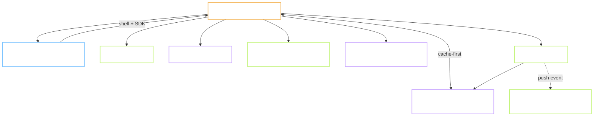
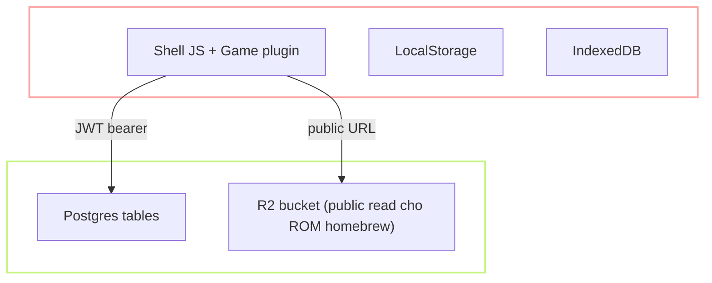
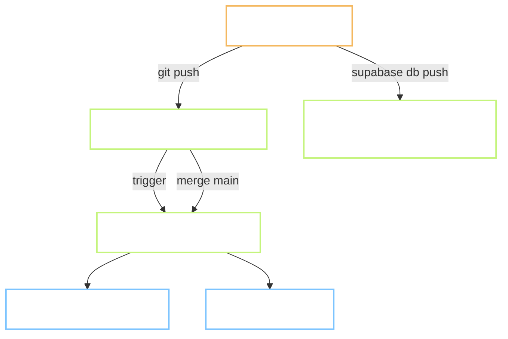

# 02 — Kiến trúc hệ thống

## 2.1 Sơ đồ tổng thể

## 2.2 Các tầng và vai trò

### Tầng Presentation (client shell)

- **Cái gì:** HTML gốc + CSS + JS entry siêu nhỏ (≤ 100KB gzip). Chứa router, danh sách game, UI leaderboard/profile, và Hub SDK để plugin game gọi vào.
- **Tại sao ở client:** không cần render động; catalog game hiếm khi đổi. Static-first cho phép CDN edge cache toàn bộ, TTFB gần 0.
- **Chọn:** Astro build ra HTML tĩnh + island JS. Fallback nếu Astro nặng cho maintainer: vanilla ES modules + template literals.

### Tầng Game runtime

- **Cái gì:** module plugin theo hợp đồng ở `07-game-plugin-spec.md`. Hai loại:
  - **Native HTML5:** JS thuần, canvas 2D/WebGL, tự quản game loop.
  - **Emulator:** wrap JSNES hoặc EmulatorJS core, expose cùng API.
- **Tại sao tách khỏi shell:** cho phép lazy-load, cho phép contributor viết game không cần build lại shell.

### Tầng Auth + Data

- **Cái gì:** Supabase — Postgres + Auth (JWT) + Realtime (WebSocket LISTEN/NOTIFY) + Storage.
- **Tại sao chọn:** xem `03-tech-stack.md` §Auth/DB — free tier vừa đủ, RLS thay backend, anonymous auth có sẵn.
- **Bảo mật:** không có backend riêng. Client nói thẳng với Supabase qua PostgREST. RLS chặn user đọc dữ liệu của user khác. Không có secret nào lộ ra client vì mọi query đều đi qua RLS.

### Tầng Object storage

- **Cái gì:** Cloudflare R2 cho asset không thay đổi (ROM homebrew, ảnh cover cỡ lớn).
- **Tại sao không dùng Supabase Storage:** R2 free tier lớn hơn (10GB vs 1GB) và không tính phí egress; ROM hay được tải lại nhiều lần → tiết kiệm băng thông đáng kể. Supabase Storage vẫn dùng nếu cần policy phức tạp (per-user file).

### Tầng Offline & cache

- **Service Worker:** cache-first cho shell, core WASM, ROM homebrew. Stale-while-revalidate cho catalog.
- **IndexedDB:** save state ẩn (chưa sync), ROM do user upload, thumbnail lớn.
- **LocalStorage:** settings nhỏ (< 5KB) — nickname tạm, tuỳ chỉnh phím.
- **Tại sao ba lớp:** ba loại dữ liệu khác nhau — bất biến (SW), có sync (IDB), preference nhỏ (LS). Ghép vào một lớp là chống pattern.

### Tầng Notification

- **Web Push (Push API + Service Worker):** opt-in, gửi daily challenge và event bạn bè.
- **Không dùng OneSignal/Firebase FCM** ở MVP — Web Push chuẩn với VAPID keys là đủ, không thêm vendor.
- **Fallback:** in-app badge trên favicon khi tab đang mở.

## 2.3 Ranh giới bảo mật

**Nguyên tắc:**
- Client không được tin. Điểm số submit lên phải qua RPC function `submit_score` có validation cơ bản (score dương, duration hợp lý, rate limit).
- Không lưu secret nào ở client. Chỉ có Supabase anon key (public theo thiết kế).
- RLS bật cho mọi bảng public. Bảng nào không cần user đọc thì service-role only.

## 2.4 Ranh giới hệ thống

Cái gì trong hệ thống, cái gì ngoài:

| Trong hệ thống | Ngoài hệ thống |
|---|---|
| Shell + Game plugin | Trình duyệt người chơi |
| Supabase project | Vendor Supabase (không sửa runtime của họ) |
| R2 bucket | Vendor Cloudflare |
| Migration SQL trong repo | Supabase Studio (chỉ dùng khi debug, không dùng làm nguồn sự thật) |

**Ghi chú:** Nguồn sự thật của schema là file migration SQL trong repo (`db/migrations/*.sql`), không phải state trên Supabase server. Supabase Studio chỉ để xem.

## 2.5 Chiến lược build và deploy

- Mỗi PR có preview URL riêng do Cloudflare Pages tạo tự động.
- Migration Supabase chạy thủ công qua `supabase db push` khi merge; tự động hoá bằng GitHub Actions ở phase sau.
- Rollback: revert commit → Cloudflare tự deploy lại; migration Postgres có bản `down` cho mỗi bản `up`.

## 2.6 Nhật ký quyết định kiến trúc (ADR)

Format: `ADR-NNN | Ngày | Bối cảnh | Lựa chọn | Alternative loại | Hệ quả`.

Chỉ ghi thêm, không sửa. Nếu quyết định cũ bị thay, tạo ADR mới với ghi chú "Supersedes ADR-NNN".

### ADR-001 | 2026-09-17 | Chọn Supabase làm auth + DB

- **Bối cảnh:** cần auth + DB + realtime free tier, có anonymous auth để không có signup wall.
- **Lựa chọn:** Supabase.
- **Alternative loại:**
  - Firebase — free tier tốt, nhưng Firestore document store gây khó cho leaderboard/aggregate query; realtime tính theo document read, dễ tràn hạn mức.
  - PocketBase self-host — miễn phí thật nhưng cần VPS, không hợp mục tiêu "0 đồng infra".
  - Cloudflare D1 + Workers — hấp dẫn nhưng auth phải tự viết; anonymous auth không native.
- **Hệ quả:** ràng buộc vào PostgREST API; migration schema cần cẩn thận. Vendor lock trung bình — schema và data có thể export chuẩn Postgres bất cứ lúc nào.

### ADR-002 | 2026-09-17 | Chọn Cloudflare Pages làm host shell

- **Bối cảnh:** cần host static hoàn toàn free, CDN toàn cầu, preview per PR.
- **Lựa chọn:** Cloudflare Pages.
- **Alternative loại:**
  - Vercel — 100GB bandwidth/tháng free là giới hạn thấp cho traffic game hub có ROM.
  - Netlify — tương tự Vercel, có giới hạn build minutes.
  - GitHub Pages — không có preview per PR, không có edge function.
- **Hệ quả:** nếu cần server function (RPC ngoài Supabase), phải chuyển sang Cloudflare Workers cùng vendor.

### ADR-003 | 2026-09-17 | Chọn plugin-first architecture cho game

- **Bối cảnh:** cần thêm game dễ, cần cho phép contributor bên ngoài, cần hỗ trợ cả emulator ROM và native HTML5.
- **Lựa chọn:** mỗi game là 1 module ES6 với manifest + hàm `mount(context)`. Xem `07-game-plugin-spec.md`.
- **Alternative loại:**
  - iframe cho mỗi game — cách ly tốt hơn nhưng cost postMessage cao, khó chia sẻ SDK và tài nguyên.
  - Monolith — dễ MVP nhưng chống pattern cho mục tiêu "thêm game trong 10 phút".
- **Hệ quả:** phải maintain SDK versioning; game cũ dùng SDK v1 phải chạy được khi shell lên v2.

### ADR-004 | 2026-09-17 | Anonymous auth trước, upgrade sau

- **Bối cảnh:** signup wall gây drop-off cao ở casual game.
- **Lựa chọn:** dùng Supabase anonymous user; upgrade sang email/OAuth sau, giữ nguyên user_id.
- **Alternative loại:**
  - Bắt đăng ký ngay — mất traffic thấy rõ.
  - Nickname-only không auth — không đồng bộ được cross-device, dễ bị mạo danh leaderboard.
- **Hệ quả:** DB có nhiều anonymous user rác; cần cron cleanup user anonymous không hoạt động 90 ngày.
