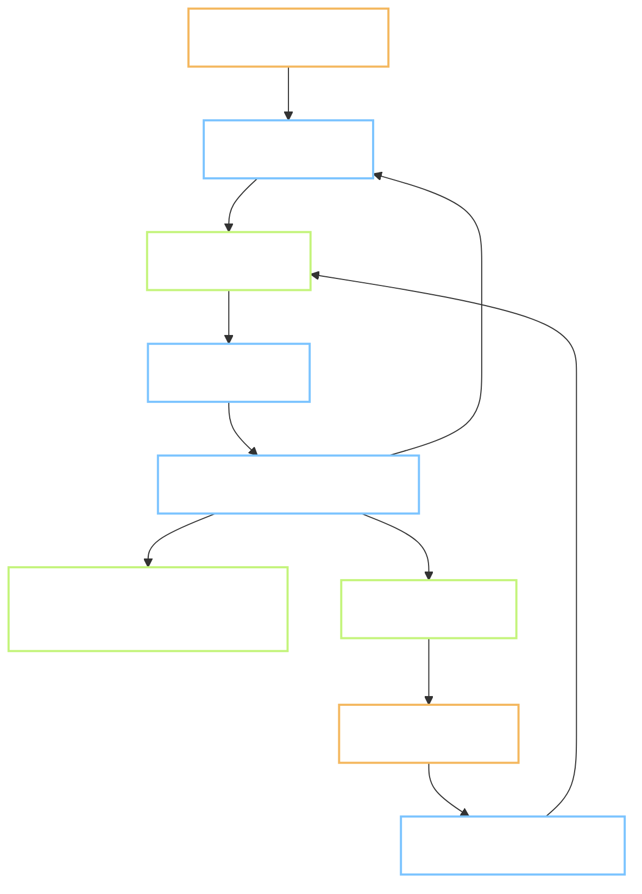
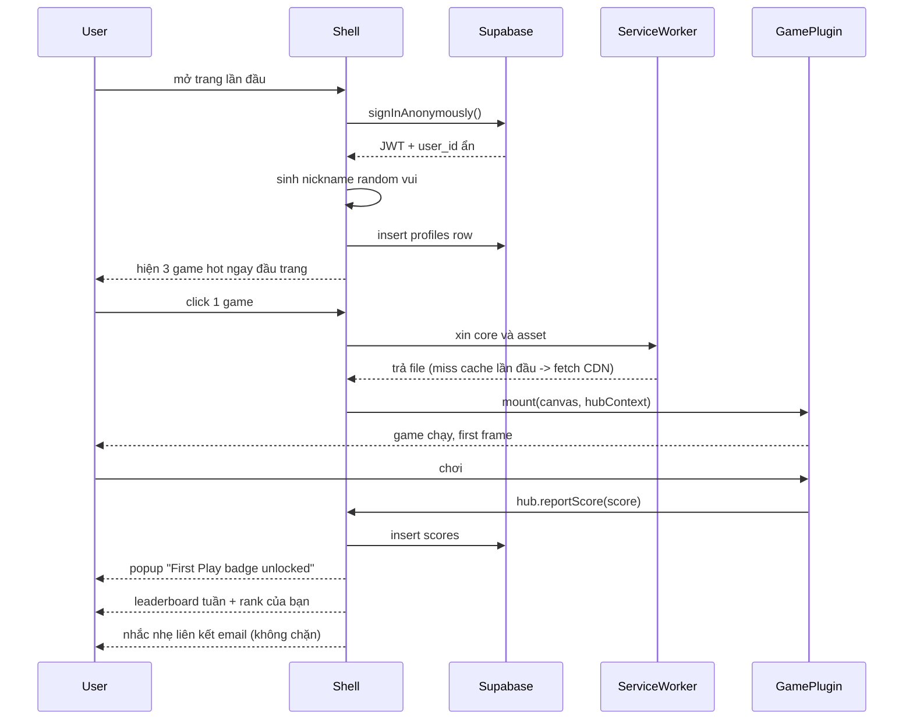
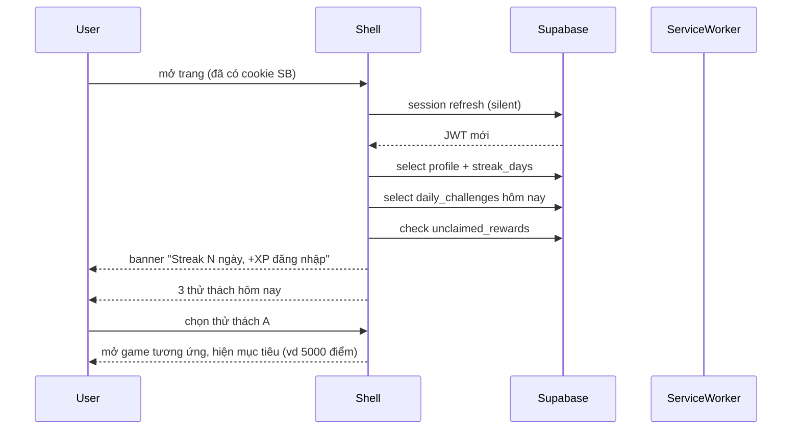
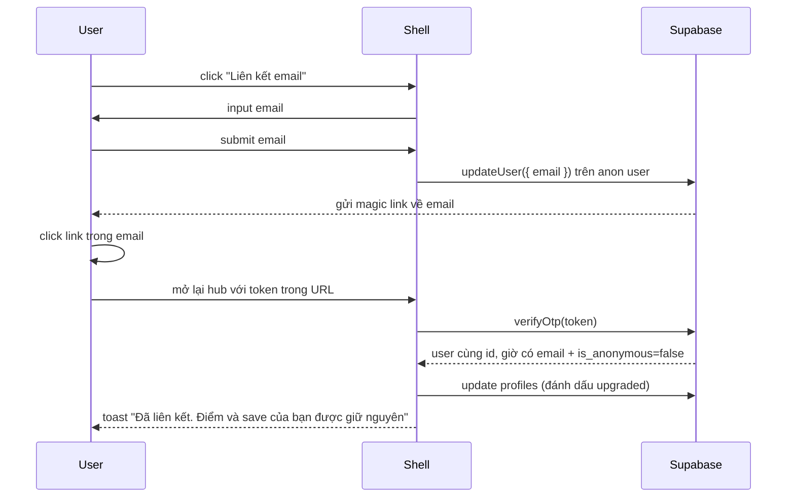
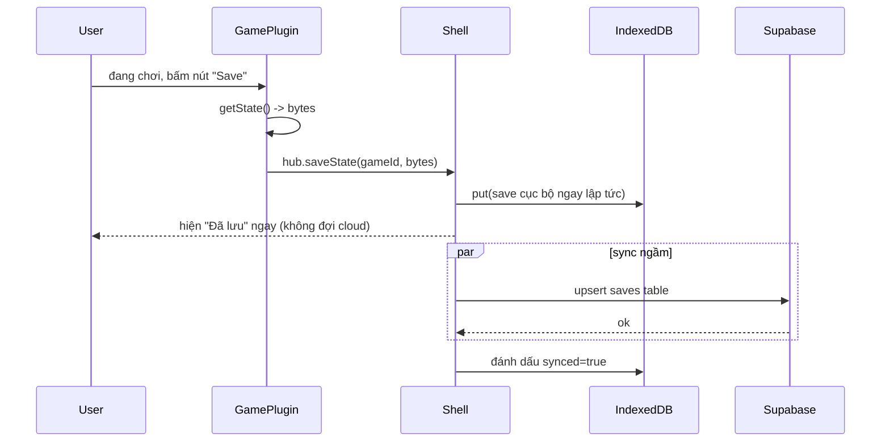
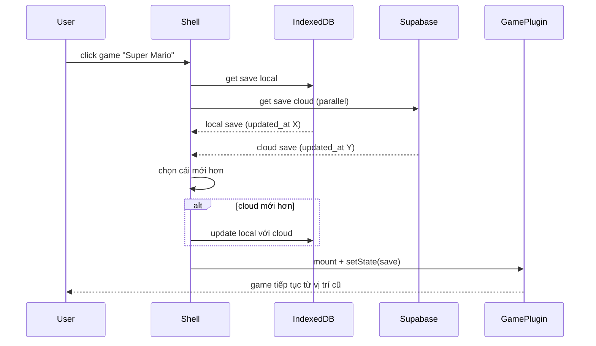
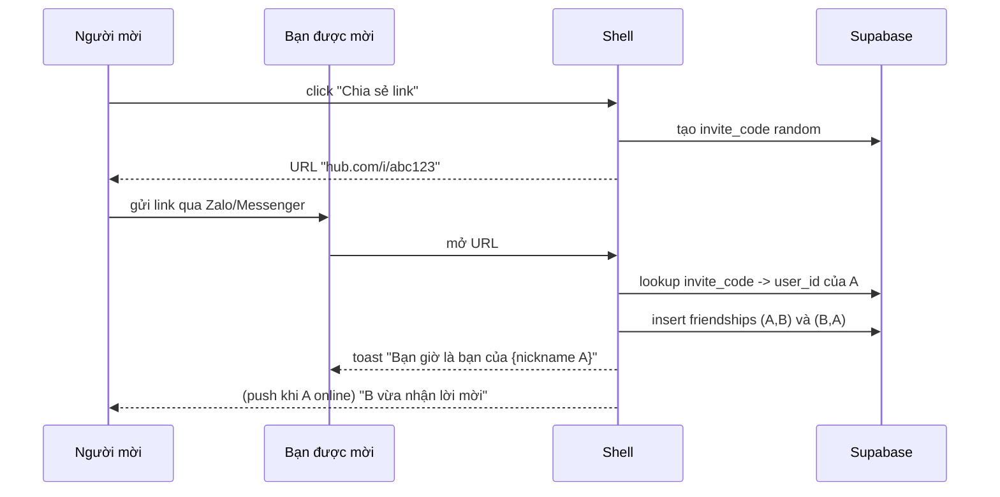
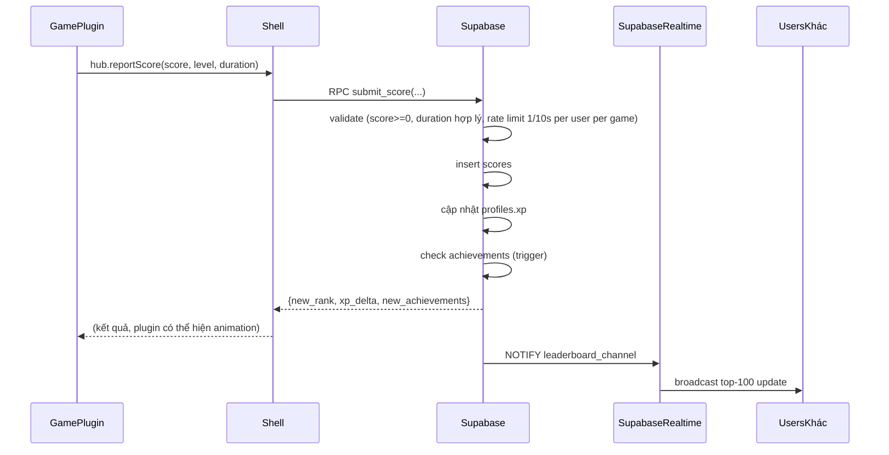
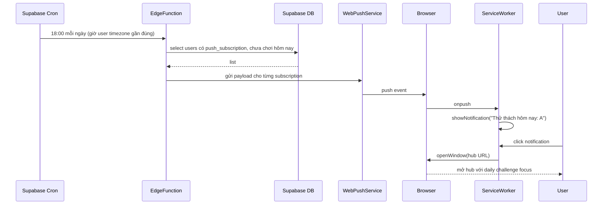

# 04 — Luồng người dùng (User Flows)

Mọi flow đều bắt đầu từ trạng thái "chưa có tài khoản" hoặc "đã có anonymous user". Không có màn hình đăng ký chặn phía trước.

## 4.1 Bản đồ tổng các flow

## 4.2 Flow A: Người chơi mới, lần đầu vào

**Mục tiêu:** tới first win trong ≤ 120 giây, không có ma sát đăng ký.

**Chi tiết bước:**

1. **Auth ẩn:** dùng `supabase.auth.signInAnonymously()`. JWT lưu vào `localStorage` mặc định của SDK.
2. **Sinh nickname:** ghép ngẫu nhiên từ 2 danh sách (tính từ vui + danh từ động vật) → "KhủngLongBaMàu42". Có nút "đổi" cho ai không thích.
3. **Insert profile:** row có `id = user_id`, `nickname`, `xp = 0`, `level = 1`, `streak_days = 0`. Idempotent (upsert).
4. **Hiện 3 game hot:** đọc từ `games` sắp xếp theo `weight DESC LIMIT 3`. Ảnh bìa ưu tiên preload.
5. **Load game:** click trigger `import('/games/<slug>/game.js')`. Có loading skeleton, không blank screen.
6. **First frame:** timeout đo trong SDK; nếu > 3s hiện thông báo "chờ chút".
7. **Report score:** SDK gọi RPC `submit_score(game_id, score, level, duration)` — không insert thẳng để có validation server-side.
8. **First Play badge:** achievement code `first_play` unlock lần đầu.
9. **Leaderboard tuần:** query view `weekly_leaderboard_view` cho `game_id`, giới hạn 100.
10. **Nhắc upgrade:** toast nhỏ ở góc, có thể tắt, không lặp lại quá 1 lần/session.

**Điểm bỏ trốn (drop-off) cần đo:**
- Bao nhiêu % người đóng tab trước khi game load xong (mục tiêu < 15%).
- Bao nhiêu % dừng chơi trước 30 giây (mục tiêu < 25%).

## 4.3 Flow B: Người chơi quay lại

**Chi tiết:**

- **Silent refresh:** SDK Supabase tự refresh token nếu chưa hết hạn.
- **Streak tăng:** RPC `check_and_update_streak()` chạy khi login lần đầu trong ngày (theo timezone user). Nếu hôm qua có chơi → streak +1, nếu không → streak reset về 1 (trừ khi có "streak freeze").
- **Daily challenges:** bảng `daily_challenges` được sinh mỗi ngày UTC 00:00 bởi cron Supabase Edge Function; mỗi user thấy chung 3 challenge của ngày (không cá nhân hoá ở MVP).
- **Unclaimed rewards:** phần thưởng bạn bè vượt qua, achievement chưa nhận → hiện dấu chấm đỏ trên icon "gift".

## 4.4 Flow C: Upgrade từ anonymous sang tài khoản email

**Điểm quan trọng:** `user_id` KHÔNG đổi khi upgrade — toàn bộ scores, saves, achievements đã có vẫn thuộc user này. Đây là feature native của Supabase Auth v2.

**Alternative không dùng:** OAuth Google/Facebook. Có sẵn nhưng để phase sau, MVP chỉ magic link email (ít ma sát, không cần OAuth app config).

## 4.5 Flow D: Save state trong game (mid-game)

**Lý do offline-first:**
- Người chơi cảm giác lưu tức thì (< 50ms) dù mạng chậm.
- Nếu offline, save vẫn có trong IDB; sync khi online lại.
- Trường hợp xung đột (cùng user save trên 2 máy): dùng `updated_at` mới nhất thắng. Ở MVP đủ; nếu cần merge phức tạp, thêm vector clock sau.

## 4.6 Flow E: Load save state khi mở lại game

## 4.7 Flow F: Kết bạn qua link mời

**Mục tiêu:** không cần friend request phức tạp. Chia sẻ 1 link → auto-follow 2 chiều.

## 4.8 Flow G: Submit điểm và leo hạng leaderboard

**Ghi chú validation server:**
- `score >= 0` (chống submit số âm phá overflow).
- `score <= 10^9` (chống submit số tràn).
- `duration >= 5s` cho mọi game (chống submit spam).
- Rate limit: 1 submit / 10 giây / user / game.
- Không anti-cheat sâu ở MVP — chấp nhận rằng leaderboard có thể bị "hack" bởi user technical. Nếu vấn đề: đưa 1 số client-side signing khoá đối xứng ngắn hạn ở phase sau.

## 4.9 Flow H: Web push daily challenge

**Ghi chú:** cron không thực sự per-timezone precise ở MVP — dùng 3 múi giờ (VN, EU, US) và gán user vào múi gần nhất dựa trên `Intl.DateTimeFormat().resolvedOptions().timeZone` lần đăng ký push.

## 4.10 Flow lỗi thường gặp

| Trường hợp | Cách xử lý |
|---|---|
| Mạng rớt giữa chơi | Save state ghi IDB, retry sync exponential backoff (1s, 2s, 5s, 15s, 60s) |
| ROM tải fail | Hiện lỗi + nút "thử lại"; không auto-retry để tránh burn băng thông |
| Score submit trùng (network resend) | RPC `submit_score` idempotent theo `client_score_id` UUID do client sinh |
| JWT hết hạn giữa session | SDK tự refresh; nếu refresh fail, chuyển về anonymous mới (mất data) — cảnh báo user nếu là account đã upgrade |
| Trình duyệt không hỗ trợ WebAssembly | Fallback: chỉ hiện game HTML5 native, ẩn game emulator |
