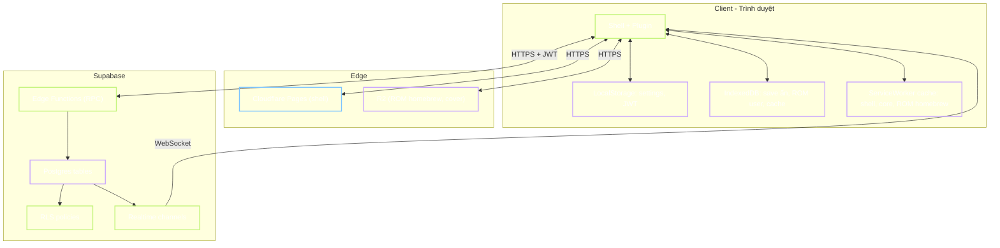
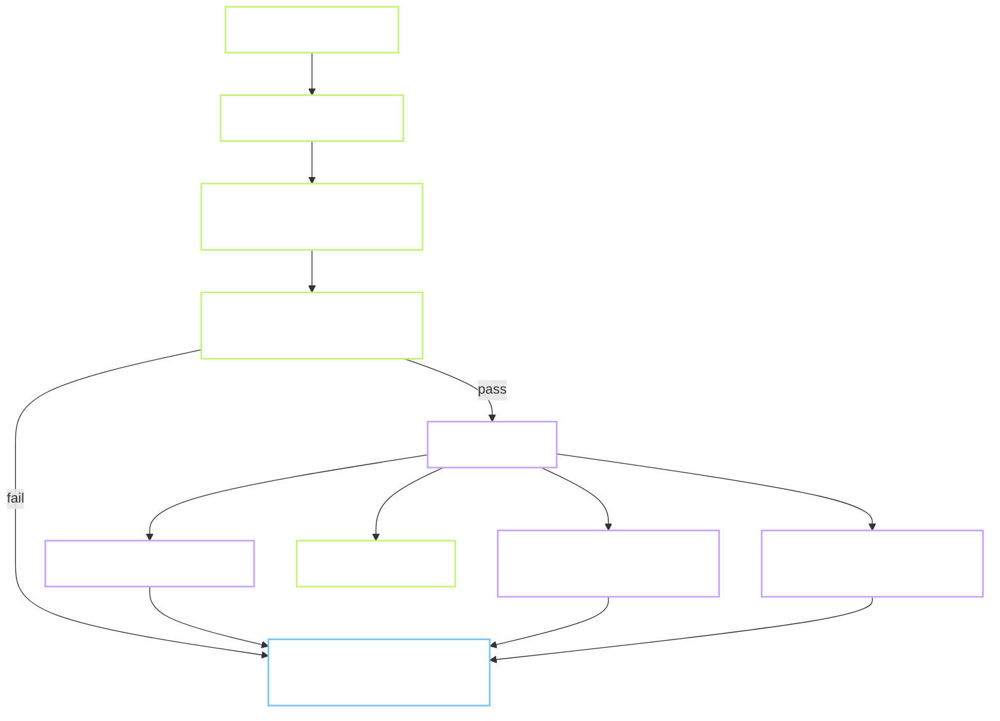
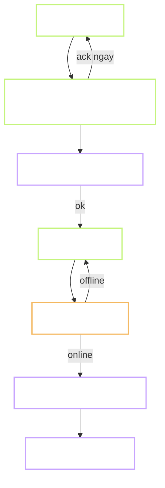
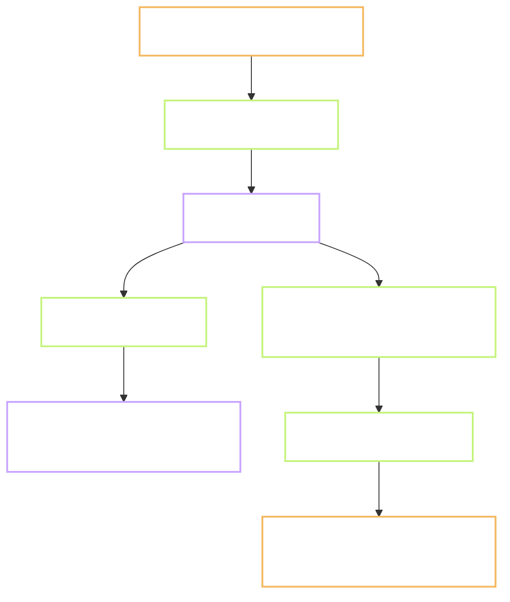
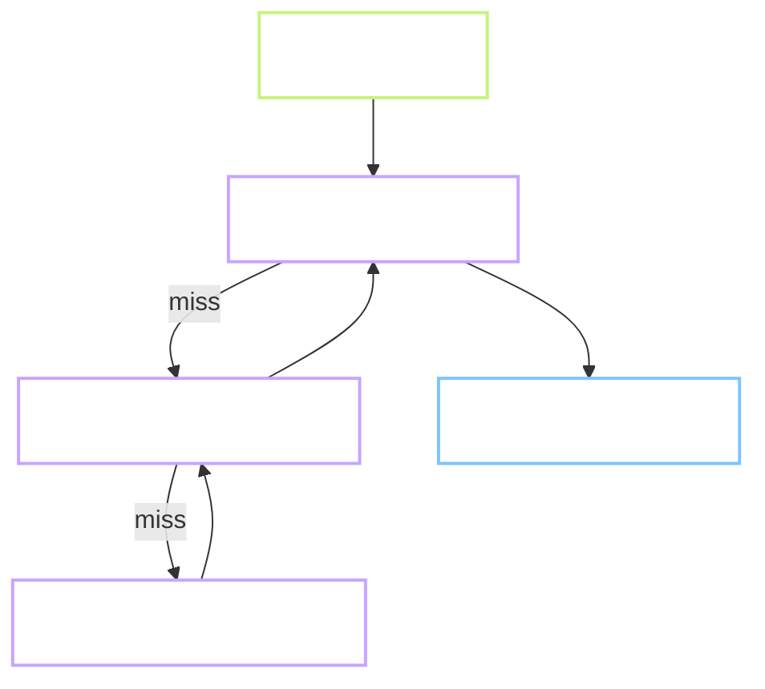

# 05 — Luồng dữ liệu (Data Flows)

Trong khi `04-user-flows.md` mô tả trải nghiệm người dùng, file này mô tả **dữ liệu di chuyển ở đâu, ai ghi, ai đọc, xác thực gì, cache đâu**.

## 5.1 Bức tranh tổng dữ liệu



## 5.2 Ma trận nguồn sự thật (source of truth)

| Loại dữ liệu | Ghi ở đâu (nguồn sự thật) | Đọc từ đâu (cache) | Sync như nào |
|---|---|---|---|
| Danh sách game (catalog) | `games` table Postgres | `games` prefetched vào memory JS + SW cache | Stale-while-revalidate, refresh khi mount app |
| Profile người chơi | `profiles` table | LocalStorage cache 60s | Cache-then-network |
| Điểm số submit | `scores` table (append-only) | Không cache lịch sử, chỉ query khi mở tab "Lịch sử" | Query on demand |
| Leaderboard top-100 | View `weekly_leaderboard_view` | Memory 30s + realtime patch | Poll 30s + WebSocket updates |
| Save state | `saves` table + IndexedDB local | IDB đọc trước, cloud sau, chọn mới hơn | Optimistic write local → sync ngầm |
| Achievement | `achievements` table | Memory sau load, tab "Huy hiệu" | Query on demand |
| Settings (phím, âm) | LocalStorage | LocalStorage | Không sync cloud (đơn giản; có thể chuyển `profiles.settings jsonb` sau) |
| ROM homebrew | R2 bucket | SW cache + IDB | Cache-first vĩnh viễn (immutable, versioned URL) |
| ROM user upload | IndexedDB (chỉ client) | IndexedDB | Không upload server |
| Core WASM emulator | Package CDN hoặc R2 | SW cache | Cache-first, invalidate khi bump version |

## 5.3 Data flow chi tiết: submit điểm



**Hợp đồng RPC (`submit_score`):**

```sql
create or replace function submit_score(
    p_game_id uuid,
    p_score bigint,
    p_level int default 0,
    p_duration_sec int default 0,
    p_client_score_id uuid default gen_random_uuid()
) returns jsonb
language plpgsql
security definer
as $$
declare
    v_user uuid := auth.uid();
    v_rank int;
    v_xp_delta int;
    v_new_achievements text[];
begin
    -- Validation
    if v_user is null then raise exception 'not authenticated'; end if;
    if p_score < 0 or p_score > 1e9 then raise exception 'invalid score'; end if;
    if p_duration_sec < 5 then raise exception 'duration too short'; end if;

    -- Rate limit
    if exists(
        select 1 from scores
        where user_id = v_user and game_id = p_game_id
          and played_at > now() - interval '10 seconds'
    ) then
        raise exception 'rate_limited';
    end if;

    -- Idempotent
    insert into scores(id, user_id, game_id, score, level_reached, duration_sec, played_at)
    values(p_client_score_id, v_user, p_game_id, p_score, p_level, p_duration_sec, now())
    on conflict (id) do nothing;

    -- Update XP (log scale, chi tiết ở doc engagement)
    v_xp_delta := least(100, greatest(10, floor(ln(p_score + 1) * 10)::int));
    update profiles set xp = xp + v_xp_delta, last_played_at = now() where id = v_user;

    -- Check achievements (function riêng)
    v_new_achievements := check_and_unlock_achievements(v_user, p_game_id, p_score);

    -- Compute rank
    select count(*) + 1 into v_rank
    from weekly_leaderboard_view
    where game_id = p_game_id and best_score > p_score;

    return jsonb_build_object(
        'rank', v_rank,
        'xp_delta', v_xp_delta,
        'new_achievements', v_new_achievements
    );
end;
$$;
```

**Chú ý:**
- `security definer` để function chạy với quyền định nghĩa (bypass RLS khi cần), nhưng vẫn dùng `auth.uid()` để lấy user hiện tại.
- Idempotent qua `p_client_score_id` — nếu client resend do mạng, không tạo bản ghi trùng.
- Không tính rank real-time toàn bảng — dùng view để hạn chế cost. Chi tiết trong `06-data-model.md`.

## 5.4 Data flow: save state đồng bộ



**Retry policy:** exponential backoff — 1s, 2s, 5s, 15s, 60s, sau đó chờ event `online` của trình duyệt. Không retry vô hạn ở background nếu tab đóng.

**Kích thước save state:**
- Native game (Tetris, Snake): thường < 1KB (state game logic).
- Emulator: 100KB - 500KB (RAM snapshot).
- Nếu > 50KB, đẩy `state_blob` lên R2 với URL prefix `saves/<user_id>/<game_id>/<timestamp>.bin`, `saves` table chỉ lưu URL.

## 5.5 Data flow: leaderboard realtime



**MVP:** client subscribe kênh `weekly_scores:<game_id>`. Khi có INSERT vào `scores`, server gửi record. Client tính lại top-100 phía client (chỉ ghép record vào list đã có).

**Không dùng materialized view** ở MVP — Postgres view thường (chỉ join + aggregate) đủ nhanh cho < 100 000 scores. Khi lên vài triệu row, xem xét materialized view refresh mỗi 30s.

## 5.6 Data flow: đọc catalog game



**Strategy:** stale-while-revalidate. Hiện data cũ từ SW cache ngay, fetch mới ở background, patch UI nếu khác.

## 5.7 Cache invalidation

Bảng cache invalidation rõ ràng để tránh "cache đâu chả biết":

| Loại cache | Key | TTL | Invalidate khi |
|---|---|---|---|
| SW: shell (index.html, css, js entry) | URL | forever | Deploy mới (hash trong URL) |
| SW: core WASM | URL versioned | forever | Bump version core |
| SW: ROM homebrew | URL versioned | forever | Không (immutable) |
| SW: catalog.json | URL | 300s stale-while-revalidate | Manual bằng "purge" endpoint |
| Memory: profile | user_id | 60s | Sau khi update tên/avatar |
| Memory: leaderboard | game_id | 30s | Realtime patch hoặc timeout |
| IDB: save state | user_id + game_id | forever | Cloud có bản mới hơn |

## 5.8 Backup và recovery

**Postgres:**
- Supabase free tier có daily backup 7 ngày (nguồn: `supabase.com/docs/guides/platform/backups`, 2026-01).
- Bổ sung: `pg_dump` hàng tuần bằng GitHub Action, push vào private repo backup. Chi phí 0 vì Actions free tier 2000 phút/tháng.

**R2:**
- File immutable, ít khi xoá. Chỉ backup thư mục "asset gốc" (cover ảnh master) vào Google Drive cá nhân.

**IndexedDB client:**
- Người chơi có thể mất data client nếu xoá dữ liệu trình duyệt. Đây là hành vi mong đợi; save state cloud là bản chính.

## 5.9 Phân tích quyền

| Bảng | Anon (chưa đăng nhập ẩn) | Anonymous user | User đã upgrade | Service role |
|---|---|---|---|---|
| games | select | select | select | insert/update/delete |
| profiles | none | select own, update own | select own, update own | full |
| scores | none | insert via RPC, select own + top-100 | như anon | full |
| saves | none | select/upsert own | như anon | full |
| achievements | none | select own | như anon | full |
| friendships | none | select own, insert own | như anon | full |
| daily_challenges | select | select | select | full |

Không có bảng nào cho phép public write trực tiếp — mọi write có validation qua RPC hoặc RLS.
