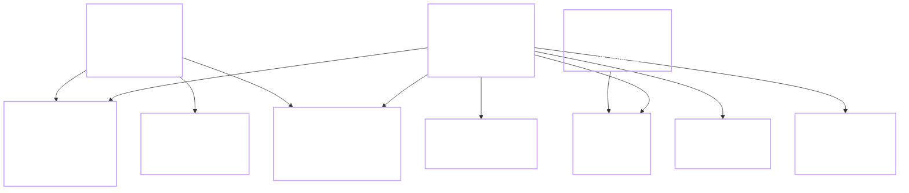

# 06 — Mô hình dữ liệu (Data Model)

Schema Postgres, index, RLS, migration. Nguồn sự thật là các file SQL trong `db/migrations/`, file này giải thích **tại sao** thiết kế như vậy.

## 6.1 Sơ đồ ERD



## 6.2 Bảng chi tiết + lý do thiết kế

### `profiles`

```sql
create table profiles (
    id uuid primary key references auth.users(id) on delete cascade,
    nickname text not null,
    avatar_url text,
    xp bigint not null default 0,
    level int not null default 1,
    streak_days int not null default 0,
    streak_last_date date,
    last_played_at timestamptz,
    settings jsonb not null default '{}',
    is_anonymous boolean not null default true,
    created_at timestamptz not null default now(),
    updated_at timestamptz not null default now()
);

create unique index idx_profiles_nickname_lower on profiles (lower(nickname));
create index idx_profiles_xp_desc on profiles (xp desc);
```

**Tại sao:**
- `id` = `auth.users.id` để 1-1 với Supabase Auth. `on delete cascade` để xoá auth user thì profile xoá theo.
- `xp bigint` — score/xp có thể tăng lớn, `int` 32-bit không đủ nếu người chơi cày.
- `streak_last_date` để tính streak (so với hôm nay), không suy ra từ `last_played_at` để tránh bug timezone.
- `settings jsonb` để tránh migration mỗi lần thêm setting nhỏ.
- `is_anonymous` phản chiếu Supabase field, để query nhanh không cần join `auth.users`.
- Unique index lowercase để không có "Bob" và "bob" cùng lúc.

### `games`

```sql
create table games (
    id uuid primary key default gen_random_uuid(),
    slug text not null unique,
    title text not null,
    system text not null,             -- 'native', 'nes', 'snes', 'gba', ...
    cover_url text,
    category text not null default 'arcade',
    weight int not null default 0,    -- ưu tiên xếp catalog
    is_active boolean not null default true,
    manifest_url text not null,       -- URL tới game.js module
    min_duration_sec int not null default 5,
    created_at timestamptz not null default now()
);

create index idx_games_active_weight on games (is_active, weight desc);
```

**Tại sao:**
- `slug` để URL đẹp (`/game/tetris`) và ổn định khi đổi title.
- `system` là string chứ không enum để dễ thêm hệ máy mới không cần migrate.
- `weight` cho phép admin ghim game hot lên đầu.
- `manifest_url` để game plugin ở CDN khác — không bó vào 1 domain.

### `scores`

```sql
create table scores (
    id uuid primary key,               -- client sinh, cho idempotent
    user_id uuid not null references profiles(id) on delete cascade,
    game_id uuid not null references games(id) on delete cascade,
    score bigint not null,
    level_reached int not null default 0,
    duration_sec int not null default 0,
    played_at timestamptz not null default now()
);

create index idx_scores_leaderboard on scores (game_id, score desc, played_at desc);
create index idx_scores_user on scores (user_id, played_at desc);
create index idx_scores_weekly on scores (game_id, played_at desc) where played_at > now() - interval '7 days';
```

**Tại sao:**
- Append-only, không update score cũ. Nếu người chơi phá kỷ lục, thêm row mới; leaderboard query lấy MAX.
- `id` do client sinh (UUID v4) để idempotent — retry mạng không tạo trùng.
- Index composite `(game_id, score desc)` là index chính cho leaderboard.
- Partial index cho weekly leaderboard tránh scan cả bảng.

### `saves`

```sql
create table saves (
    user_id uuid not null references profiles(id) on delete cascade,
    game_id uuid not null references games(id) on delete cascade,
    slot smallint not null default 0,
    state_blob bytea,                  -- inline nếu nhỏ
    state_url text,                    -- link R2 nếu lớn
    level int not null default 0,
    updated_at timestamptz not null default now(),
    primary key (user_id, game_id, slot),
    check (state_blob is not null or state_url is not null)
);

create index idx_saves_user on saves (user_id, updated_at desc);
```

**Tại sao:**
- Primary key composite (user, game, slot) — mỗi cặp game+slot ghi đè, không giữ lịch sử. Nếu cần undo, chuyển `state_blob` sang table `save_history` phase sau.
- `slot` cho quicksave/manualsave — mặc định slot 0.
- `state_blob` bytea hoặc `state_url` R2 — xor: chỉ 1 trong 2, check constraint.

### `achievement_defs` và `achievements`

```sql
create table achievement_defs (
    code text primary key,             -- 'first_play', 'streak_7', 'score_100k_tetris'
    title text not null,
    description text not null,
    icon_url text,
    criteria jsonb not null,           -- {"type":"score","game":"tetris","min":100000}
    xp_reward int not null default 50
);

create table achievements (
    id bigserial primary key,
    user_id uuid not null references profiles(id) on delete cascade,
    code text not null references achievement_defs(code) on delete cascade,
    unlocked_at timestamptz not null default now(),
    unique (user_id, code)
);

create index idx_achievements_user on achievements (user_id, unlocked_at desc);
```

**Tại sao tách defs khỏi user's unlock:**
- Định nghĩa achievement (icon, tiêu chí) là **content**, không phải data user. Tách để có thể sửa description/icon không ảnh hưởng data.
- `criteria jsonb` cho phép định nghĩa achievement mới không cần migrate schema — chỉ insert def mới.

### `friendships`

```sql
create table friendships (
    user_id uuid not null references profiles(id) on delete cascade,
    friend_id uuid not null references profiles(id) on delete cascade,
    created_at timestamptz not null default now(),
    primary key (user_id, friend_id),
    check (user_id <> friend_id)
);

create index idx_friendships_friend on friendships (friend_id);
```

**Tại sao 2 chiều được insert 2 row:**
- Đơn giản query "bạn bè của tôi" — chỉ cần `where user_id = me`.
- Trade-off: 2x storage, nhưng bảng nhỏ.

### `invite_codes`

```sql
create table invite_codes (
    code text primary key,
    user_id uuid not null references profiles(id) on delete cascade,
    expires_at timestamptz not null default (now() + interval '30 days'),
    uses_left int not null default 100
);
```

**Tại sao có `uses_left`:** chống 1 link viral thu vô hạn friend request; giới hạn 100 lượt.

### `daily_challenges`

```sql
create table daily_challenges (
    challenge_date date not null,
    slot smallint not null,            -- 0, 1, 2
    game_id uuid not null references games(id),
    goal_type text not null,           -- 'reach_score', 'play_duration', 'unlock_level'
    goal_value bigint not null,
    xp_reward int not null default 100,
    primary key (challenge_date, slot)
);

create table daily_challenge_completions (
    user_id uuid not null references profiles(id) on delete cascade,
    challenge_date date not null,
    slot smallint not null,
    completed_at timestamptz not null default now(),
    primary key (user_id, challenge_date, slot)
);
```

**Tại sao 2 bảng:** định nghĩa challenge chung mọi user; completion per-user riêng.

### `push_subscriptions`

```sql
create table push_subscriptions (
    id bigserial primary key,
    user_id uuid not null references profiles(id) on delete cascade,
    endpoint text not null unique,
    p256dh text not null,
    auth text not null,
    timezone_hint text,
    created_at timestamptz not null default now()
);
```

**Tại sao `endpoint` unique:** 1 browser 1 subscription, tránh duplicate push.

## 6.3 Views

### `weekly_leaderboard_view`

```sql
create view weekly_leaderboard_view as
select
    s.game_id,
    s.user_id,
    p.nickname,
    p.avatar_url,
    max(s.score) as best_score,
    max(s.played_at) as last_played_at
from scores s
join profiles p on p.id = s.user_id
where s.played_at > now() - interval '7 days'
group by s.game_id, s.user_id, p.nickname, p.avatar_url;
```

Không phải materialized. Postgres query planner + partial index `idx_scores_weekly` xử lý ổn cho < 100k row.

## 6.4 RLS policies

Bật RLS mọi bảng public:

```sql
alter table profiles enable row level security;
alter table scores enable row level security;
alter table saves enable row level security;
alter table achievements enable row level security;
alter table friendships enable row level security;
alter table push_subscriptions enable row level security;
alter table daily_challenge_completions enable row level security;
```

Policy ví dụ (`profiles`):

```sql
create policy "profiles read own"
    on profiles for select
    using (auth.uid() = id);

create policy "profiles read others public fields"
    on profiles for select
    using (true);  -- ai đọc cũng được (leaderboard cần nickname/avatar)

create policy "profiles update own"
    on profiles for update
    using (auth.uid() = id)
    with check (auth.uid() = id);
```

**Ghi chú:** cho phép public read `profiles` chỉ ổn nếu profiles không có field nhạy cảm. Email nằm ở `auth.users`, không expose qua view — an toàn.

Policy `scores`:

```sql
create policy "scores read all"
    on scores for select using (true);   -- leaderboard cần

-- KHÔNG cho insert trực tiếp; phải qua RPC submit_score
create policy "scores no direct insert"
    on scores for insert
    with check (false);
```

Insert được thực hiện trong RPC `submit_score` với `security definer` — bypass RLS insert an toàn có kiểm soát.

Policy `saves`:

```sql
create policy "saves own only"
    on saves for all
    using (auth.uid() = user_id)
    with check (auth.uid() = user_id);
```

## 6.5 Migration strategy

- **Tool:** Supabase CLI (`supabase db push`) hoặc raw psql script.
- **Convention filename:** `db/migrations/YYYYMMDDHHMM_<slug>.sql`. Có bản `up` (bắt buộc) và `down` (khuyến khích) trong cùng file, phân biệt bằng comment `-- +up` / `-- +down`.
- **Không sửa migration đã push production.** Nếu sai, viết migration mới sửa lại.
- **Seed data:** `db/seed.sql` cho catalog game mặc định và achievement_defs. Chạy tay khi tạo project mới.

## 6.6 Ước lượng dung lượng

Ước tính cho 5000 MAU, mỗi user chơi trung bình 20 lần/tuần:

| Bảng | Row/tháng | Bytes/row | Tổng/tháng |
|---|---|---|---|
| profiles | +2000 | 400 | 800KB (tích luỹ) |
| scores | 5000 × 20 × 4 = 400 000 | 100 | 40MB |
| saves | 5000 × 3 game = 15 000 | 1KB avg | 15MB (không đẩy R2) |
| achievements | 5000 × 5 = 25 000 | 60 | 1.5MB |
| friendships | 5000 × 10 = 50 000 | 60 | 3MB |
| daily_challenges | 3/ngày × 30 = 90 | 100 | 9KB |
| daily_challenge_completions | 5000 × 30 × 0.3 = 45 000 | 60 | 2.7MB |

**Tổng ước lượng tháng đầu 5000 MAU:** ~65MB. Còn cách xa giới hạn 500MB. Sang tháng thứ 8 mới có thể chạm — lúc đó lên Pro hoặc rotate `scores` bảng cũ.

## 6.7 Chiến lược scale khi vượt free tier

Không phải bây giờ, ghi lại để không quên:

1. **Rotate scores** — giữ 90 ngày gần nhất trong `scores`; đẩy cũ hơn sang `scores_archive` (partition Postgres theo tháng).
2. **Đẩy save state lên R2** hoàn toàn — bảng `saves` chỉ giữ URL.
3. **Supabase Pro $25/tháng** nếu vượt 50k MAU.
4. **Migrate sang Neon + tự viết auth** nếu Supabase đổi chính sách. Schema Postgres chuẩn, migrate không quá 1 tuần công.
