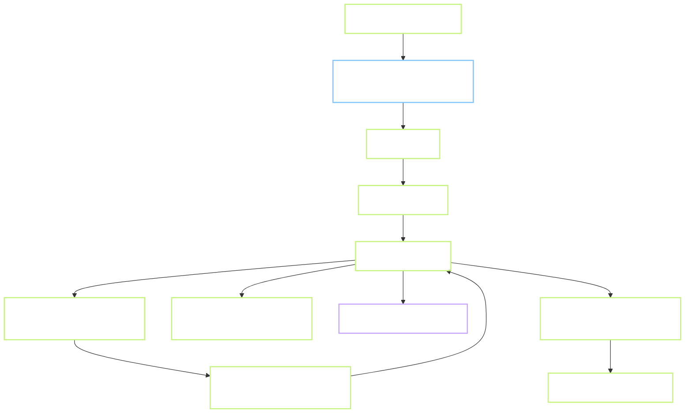

# 07 — Hợp đồng plugin game

File này là **hợp đồng** giữa hub shell và từng game module. Contributor viết game mới chỉ cần đọc file này là đủ.

## 7.1 Nguyên tắc

- **1 game = 1 folder = 1 ES module.** Không phụ thuộc build tool riêng.
- **Không tự truy cập Supabase/R2.** Mọi I/O đi qua Hub SDK (`hub.*`).
- **Không đụng DOM ngoài canvas được cấp.** Không tự tạo `<div>` gắn `body`.
- **Không phá event listener global** (không `window.addEventListener('keydown', ...)` mà không cleanup khi stop).
- **Có thể chạy trong Web Worker** ở tương lai — vì thế không đụng `document` trực tiếp trong logic; chỉ đụng khi cần trong hàm mount.

## 7.2 Cấu trúc folder

```
games/tetris/
├── game.json           # manifest
├── game.js             # module ES6, default export
├── assets/
│   ├── sprites.png
│   └── sfx/*.ogg
└── README.md           # dành cho contributor
```

## 7.3 Manifest `game.json`

```json
{
  "id": "tetris",
  "slug": "tetris",
  "title": "Tetris",
  "version": "1.0.0",
  "system": "native",
  "cover": "/games/tetris/assets/cover.webp",
  "category": "puzzle",
  "controls": {
    "keyboard": ["ArrowLeft", "ArrowRight", "ArrowDown", "ArrowUp", "Space"],
    "gamepad": ["dpad", "a", "b"],
    "touch": ["dpad", "buttons"]
  },
  "hasSave": true,
  "hasScore": true,
  "minSdkVersion": "1.0.0",
  "minDurationSec": 5,
  "aspectRatio": "10:20"
}
```

**Ràng buộc:**
- `id` = `slug` = tên folder. Không có 2 game trùng id.
- `system` ∈ `{native, nes, snes, gba, genesis, gb, gbc}`. Thêm hệ máy mới cần bump SDK version.
- `aspectRatio` để shell cấp canvas kích thước hợp lý (không co giãn méo).

## 7.4 Interface module `game.js`

```ts
// Type contract (giả TypeScript để rõ, plugin có thể viết JS + JSDoc)
export interface GameManifest { /* như game.json */ }
export const manifest: GameManifest;

export interface HubContext {
  canvas: HTMLCanvasElement;
  audioContext: AudioContext;
  user: { id: string; nickname: string; avatarUrl: string | null };
  input: InputSystem;

  // I/O
  reportScore(score: number, level?: number, durationSec?: number): Promise<ScoreResult>;
  saveState(bytes: Uint8Array, slot?: number): Promise<void>;
  loadState(slot?: number): Promise<Uint8Array | null>;
  unlockAchievement(code: string): Promise<void>;

  // HUD (live) — plugin gọi mỗi lần score/level đổi để shell cập nhật ngoài canvas.
  // Rẻ, không throttle nội bộ; nếu gọi rất dày (>60Hz), plugin tự throttle.
  setHud(state: { score?: number; level?: number }): void;

  // UI helper
  showToast(msg: string, opts?: { duration?: number; kind?: 'info'|'ok'|'warn' }): void;
  requestFullscreen(): Promise<void>;

  // Analytics
  event(name: string, props?: Record<string, unknown>): void;
}

export interface GameInstance {
  start(): void;
  pause(): void;
  resume(): void;
  stop(): Promise<void>;              // MUST cleanup listeners, RAF, worker
  getState?(): Uint8Array;            // required nếu hasSave=true
  setState?(bytes: Uint8Array): void; // required nếu hasSave=true
}

export default function mount(ctx: HubContext): GameInstance;
```

**Yêu cầu bắt buộc:**
- `stop()` phải cancel mọi `requestAnimationFrame`, gỡ mọi listener đã đăng ký, đóng `AudioContext` node.
- Không dùng `alert/confirm/prompt` — dùng `ctx.showToast`.
- Không tạo XHR/fetch trực tiếp — nếu cần asset, đặt trong `assets/` và load qua URL tương đối.

## 7.5 Input system

```ts
interface InputSystem {
  isDown(button: Button): boolean;
  onPress(button: Button, cb: () => void): Disposer;
  onRelease(button: Button, cb: () => void): Disposer;
}

type Button = 'up'|'down'|'left'|'right'|'a'|'b'|'x'|'y'|'start'|'select';
```

**SDK tự lo:**
- Keyboard → button map (mặc định + user remap).
- Gamepad API polling.
- Touch overlay (dpad + buttons).

Plugin **không cần biết** người chơi đang dùng bàn phím hay gamepad — chỉ hỏi `input.isDown('a')`.

## 7.6 Vòng đời game



**Ai gọi ai:**
- Shell tự động gọi `pause/resume` khi tab ẩn/hiện (Page Visibility API).
- Shell tự động gọi `stop` khi user bấm nút Back hoặc điều hướng đi.
- Plugin chỉ khởi động vòng lặp trong `start`, không trong `mount` (vì user có thể mount rồi lại thoát mà chưa chơi).

## 7.7 SDK version

- **v1.0.0** là contract này.
- Thay đổi breaking → bump major, hub giữ 2 major version cùng lúc (v1 và v2) trong 3 tháng.
- Manifest `minSdkVersion` cho phép shell từ chối load plugin quá cũ hoặc quá mới.

## 7.8 Bảo mật plugin

**Threat model:** contributor viết plugin có thể là bad actor.

**Giảm nhẹ ở MVP:**
- Chỉ chấp nhận plugin do team review trong repo chính (whitelist theo `manifest_url` domain).
- Không load plugin từ URL người dùng nhập tuỳ ý.

**Tương lai (nếu cần cộng đồng đóng góp):**
- Chạy plugin trong iframe sandbox `sandbox="allow-scripts"` (không allow-same-origin), giao tiếp qua postMessage.
- Cost: chậm hơn ~5-10% do postMessage overhead, chấp nhận được nếu đổi lấy an toàn.

## 7.9 Ví dụ tối thiểu (Snake)

```js
// games/snake/game.js
export const manifest = {
  id: "snake", slug: "snake", title: "Snake", version: "1.0.0",
  system: "native", cover: "/games/snake/cover.webp",
  category: "arcade", controls: { keyboard: ["ArrowUp","ArrowDown","ArrowLeft","ArrowRight"] },
  hasSave: false, hasScore: true, minSdkVersion: "1.0.0",
  minDurationSec: 5, aspectRatio: "1:1"
};

export default function mount(ctx) {
  const { canvas, input } = ctx;
  const g = canvas.getContext("2d");
  let snake, food, dir, score, rafId, running = false;

  function reset() {
    snake = [{x:10,y:10}]; food = {x:5,y:5}; dir = {x:1,y:0}; score = 0;
  }

  function tick() {
    if (!running) return;
    // ... logic ...
    rafId = requestAnimationFrame(tick);
  }

  const handlers = [
    input.onPress("up", () => { if (dir.y === 0) dir = {x:0,y:-1}; }),
    input.onPress("down", () => { if (dir.y === 0) dir = {x:0,y:1}; }),
    input.onPress("left", () => { if (dir.x === 0) dir = {x:-1,y:0}; }),
    input.onPress("right", () => { if (dir.x === 0) dir = {x:1,y:0}; }),
  ];

  return {
    start() { reset(); running = true; tick(); },
    pause() { running = false; cancelAnimationFrame(rafId); },
    resume() { running = true; tick(); },
    async stop() {
      running = false;
      cancelAnimationFrame(rafId);
      handlers.forEach(off => off());
      await ctx.reportScore(score, 0, /* duration */ Math.floor(performance.now()/1000));
    }
  };
}
```

## 7.10 Checklist review plugin

Trước khi merge 1 game mới:

- [ ] Bundle chưa gzip < 500KB (không tính asset)
- [ ] `stop()` gỡ tất cả listener và cancelAnimationFrame
- [ ] Không có `console.log` sót
- [ ] Không có `alert/confirm/prompt`
- [ ] Không tạo `<script>`, `<iframe>`, `` gắn `body`
- [ ] Không fetch domain ngoài
- [ ] Test bàn phím và touch overlay
- [ ] Score submit hợp lệ (positive, duration >= 5s)
- [ ] Có `README.md` mô tả cách chơi
- [ ] Đã thêm entry vào `games/index.json`
- [ ] License MIT hoặc tương thích trong `game.json` field `license`
