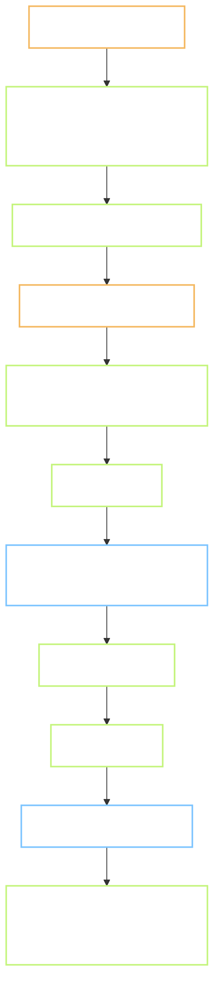

# 09 — Workflow phát triển

Quy trình từ ý tưởng → production. Áp dụng cho cả maintainer chính và contributor.

## 9.1 Vòng phát triển sprint

Theo chuẩn team Delfi: **Plan drop → Review gate → Code → Publish outcome drop**.



**Bỏ qua plan drop chỉ khi:** sửa 1 dòng (typo, đổi màu). Nếu bundle ≥ 2 sửa nhỏ, vẫn viết outcome drop tổng kết.

## 9.2 Branch và commit

**Prefix branch:**
- `feature/<slug>` — tính năng mới.
- `fix/<slug>` — sửa bug.
- `chore/<slug>` — build, docs, deps, formatting.
- Không dùng `wip/`, `integration/`, `dev/`.

**Prefix commit (Conventional):**
- `feat: ...` — feature user thấy.
- `fix: ...` — bug fix.
- `chore: ...` — không ảnh hưởng runtime.
- `refactor: ...` — đổi code không đổi behavior.
- `docs: ...` — doc thay đổi.
- `perf: ...` — cải thiện hiệu năng.
- `test: ...` — thêm/sửa test.

**Nội dung commit message:**
- Short, factual, focus vào diff.
- Không marketing ("seamless", "robust", "comprehensive").
- Không "Generated with Claude", không "Co-Authored-By: Claude".
- Một câu là đủ. Nhiều thay đổi → bullet list, mỗi bullet 1 dòng.

Ví dụ tốt:
```
feat: add Snake game plugin
fix: rate limit submit_score chặn retry hợp lệ trong 10s
chore: bump @supabase/supabase-js to 2.44.0
```

Ví dụ tránh:
```
feat: seamlessly integrated a robust and comprehensive snake game experience
```

## 9.3 Pull Request

- **Title:** như commit, ≤ 70 ký tự.
- **Body:** ngắn, lead bằng diff. Không ceremony Summary/Test-plan trừ khi được yêu cầu.
- **Không** thêm footer Claude, Co-Author, Generated.
- **Repo mặc định private.**
- **Preview URL:** Cloudflare tự sinh, dán vào PR body.
- **1 PR = 1 concern.** Bundling nhiều tính năng thì split.

## 9.4 Review checklist

Cho reviewer (và tự review):

- [ ] Có Plan drop tương ứng đã được duyệt (link trong PR)?
- [ ] Không có emoji trong code/doc/commit
- [ ] Không có `console.log` sót, không có `// TODO` mới không kèm issue
- [ ] Test đi kèm (unit hoặc e2e) cho code có logic
- [ ] Doc trong repo được cập nhật cùng PR (nếu ảnh hưởng)
- [ ] Migration Postgres có bản `down`
- [ ] RLS được xét cho bảng mới
- [ ] Bundle không phình lên (kiểm tra bằng `pnpm run analyze`)
- [ ] Preview URL chạy, chơi thử 1 game tới score submit

## 9.5 Deploy

**Production:**
- Merge vào `main` → Cloudflare Pages tự build và deploy.
- URL production: `https://gamehub.pages.dev` (đổi domain khi có).
- Không có staging environment riêng ở MVP — mỗi PR preview đủ vai trò staging.

**Migration DB:**
- Chưa auto — chạy tay:
  ```bash
  supabase db push --db-url $SUPABASE_URL
  ```
- Ghi log vào `PROGRESS.md` mục "Migrations applied".
- Automation phase sau: GitHub Action chạy migration khi có file mới trong `db/migrations/`.

**Rollback:**
- Frontend: `git revert <sha>` → push → Cloudflare deploy lại. Không cần lệnh CDN riêng.
- DB: migration có bản `down`; chạy tay khi cần. Nếu data đã ghi khiến rollback không an toàn, viết migration mới sửa forward.

## 9.6 Hotfix

Với bug production nghiêm trọng (game không load, submit score fail):

1. Tạo `fix/<slug>` từ `main`.
2. Sửa + test local.
3. Mở PR, tag `[hotfix]` trong title.
4. Merge nhanh sau 1 review, không cần plan drop nếu < 30 phút công.
5. Viết outcome drop ngắn sau khi deploy xong.

## 9.7 Môi trường phát triển local

Yêu cầu:
- Node 20 LTS (CI dùng 20; Node 24 chạy được local nhưng kiểm chéo trên CI trước khi push).
- pnpm 11 (repo pin `packageManager: pnpm@11.6.0`).
- Supabase CLI (`brew install supabase/tap/supabase` hoặc scoop).
- Docker Desktop (chỉ để chạy Supabase local, không bắt buộc — có thể dùng project Supabase cloud dev).

Setup:
```bash
pnpm install
cp .env.example .env.local
# Điền SUPABASE_URL, SUPABASE_ANON_KEY, VAPID_PUBLIC_KEY

pnpm dev              # Astro dev server tại :4321
supabase start        # Postgres local ở :54322, nếu dùng local mode
supabase db reset     # apply migrations + seed
```

### Gotcha: pnpm 11 `allowBuilds`

pnpm 11 chặn mọi native postinstall script mặc định. Astro cần `esbuild` và `sharp` build trong lúc install → nếu không cho phép, `pnpm install` sẽ dừng chờ approval.

Repo đã pin cấu hình trong `pnpm-workspace.yaml`:
```yaml
allowBuilds:
  esbuild: true
  sharp: true
```

Nếu dev mới clone repo mà install treo, kiểm tra file này tồn tại. Thêm entry cho dependency native mới khi cần (dependency báo trong log `Ignored build scripts:`).

### Cross-platform note

Phần lớn dev + CI chạy Linux/macOS. Trên Windows PowerShell:
- Path separator dùng `\` — không ảnh hưởng pnpm/Vite (họ chuẩn hoá).
- Playwright visual baseline lưu suffix `-chromium-win32.png`, khác `-linux.png` của CI. Chi tiết ở §10.21 (`10-implementation-notes.md`).
- Kill stale dev server port 4321 khi Playwright báo lỗi lạ: `Get-NetTCPConnection -LocalPort 4321` rồi `Stop-Process -Id <PID>`.

### Sinh visual baseline cho CI (chromium-linux)

CI chạy ubuntu-latest → cần `-chromium-linux.png`, khác baseline local `-chromium-win32.png`. Test tự skip trên CI khi thiếu linux baseline (fs check trong `visual.spec.ts`). Hai cách sinh:

**Cách 1 — CI workflow (không cần Docker local):**

1. Push branch lên GitHub.
2. Tab `Actions` → chọn workflow `Visual baselines (regenerate)` → `Run workflow`.
3. CI chạy Playwright headless linux, sinh baseline `-chromium-linux.png`, tự commit vào branch với message `chore: regenerate linux visual baselines`.
4. Pull về, CI lần tới sẽ bật visual test.

**Cách 2 — Local Docker:**

```bash
bash scripts/gen-linux-baselines.sh
```

Script pull Playwright image cùng version `@playwright/test` trong `package.json`, mount repo, chạy `playwright test tests/e2e/visual.spec.ts --update-snapshots`. Kết quả: file `*-chromium-linux.png` mới trong `tests/e2e/visual.spec.ts-snapshots/`. Commit tay.

**Khi nào cần chạy lại:** mỗi lần redesign UI đáng kể (thay layout, đổi component visual). Không cần chạy khi chỉ đổi logic hoặc chuỗi chữ trong shell chrome cho screenshot đã mask.

## 9.8 Testing strategy

**Unit test (Vitest):**
- Utility function (score calc, xp curve, level threshold).
- SDK internals (input mapping, save state serialize).

**Integration test (Vitest + Supabase local):**
- RPC `submit_score` với các case: valid, negative, rate-limited, idempotent.
- Achievement trigger unlock.

**E2E test (Playwright):**
- Onboarding flow: mở trang → chơi Snake → submit score → thấy leaderboard.
- Save/load state: mở game, save, refresh, load lại.
- Upgrade tài khoản: từ anonymous → magic link → data giữ nguyên.

**Không test:**
- Emulator internals (không phải code của mình).
- Third-party SDK.
- CSS visual (dùng manual check ở preview URL).

Mục tiêu coverage: **60% cho SDK, 80% cho RPC** (những phần logic nghiệp vụ). Không đuổi 100% — không đáng.

## 9.9 Monitoring và alerting

**MVP:**
- Cloudflare Web Analytics — Web Vitals.
- Supabase Dashboard — DB size, active users, error log.
- Không có alerting tự động — check dashboard 2 lần/tuần.

**Phase sau:**
- Sentry free tier cho JS error.
- Cloudflare Alert email khi Pages build fail.

## 9.10 Bảo trì phụ thuộc

- Dependabot bật cho `package.json` — PR tự động cho patch/minor.
- Major bump review kỹ (Astro, Supabase JS, EmulatorJS).
- Cadence: xem PR dependabot mỗi thứ Sáu.

## 9.11 Đóng góp từ bên ngoài

**Contributor viết game plugin:**
1. Fork repo, tạo branch `feature/game-<slug>`.
2. Copy `games/_template/` sang `games/<slug>/`.
3. Điền manifest, viết game.
4. Chạy `pnpm run lint` và `pnpm run test`.
5. Mở PR — checklist ở `07-game-plugin-spec.md` §Review.

Không chấp nhận PR đóng góp:
- ROM (không host commercial).
- Analytics/tracker của bên thứ ba.
- Đổi lõi hub mà không có discussion issue trước.

## 9.12 Ngôn ngữ commit và docs

- Docs trong repo: **tiếng Việt**.
- Commit message: **tiếng Việt hoặc tiếng Anh**, không mix.
- Code identifier (biến, hàm, class): **tiếng Anh chuẩn**.
- Comment code (khi cần): **tiếng Việt hoặc Anh**, ngắn gọn.
