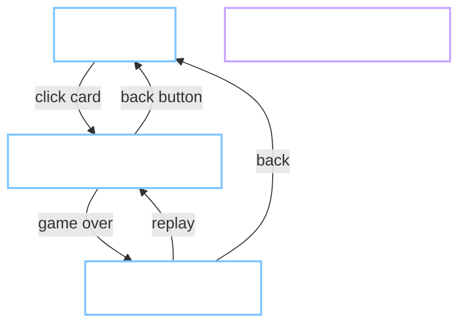

# 12 — UI/UX Design

Design system + wireframe cho Phase 1.5. Là nguồn sự thật cho token, component, IA. Sửa code UI mà lệch file này → phải cập nhật đồng bộ trong cùng PR (theo `00-index.md` quy ước).

## 12.1 Audit UI hiện tại (Phase 1 MVP)

Đánh giá thẳng, không marketing. Danh sách vấn đề cần đóng trước khi ghép auth/cloud.

| # | Vấn đề | Vị trí | Ảnh hưởng |
|---|---|---|---|
| A1 | Không có design tokens. Màu, spacing, radius hard-code rải rác `styles.css` | `src/shell/styles.css` toàn file | Không đổi theme được, không nhất quán |
| A2 | Không có component reusable. Mỗi view tự viết CSS lại | `views/home.ts`, `views/game.ts`, `views/result.ts` | Sửa 1 chỗ phải sửa 3 chỗ |
| A3 | Home trơ: chỉ tiêu đề + grid card. Không hero, không phân loại, không "tiếp tục chơi" | `views/home.ts` | Không dẫn dắt người mới, không giữ người quay lại |
| A4 | Game view: toolbar 1 hàng, canvas nổi giữa không frame, HUD điểm nằm trong canvas (do game vẽ) | `views/game.ts` | Không phân biệt shell với game, hint text dài chiếm chỗ |
| A5 | Result screen: giống pop-up flat, không có badge trực quan "kỷ lục mới", CTA không rõ ưu tiên | `views/result.ts` | Không cảm giác thành tựu, replay khó tìm |
| A6 | Touch overlay đè cạnh dưới canvas trên màn nhỏ (dpad + AB vẫn nằm dưới stage nhưng gap thị giác 0) | `styles.css` `.touch-controls` | Ngón tay che stage khi chơi |
| A7 | Không có focus ring rõ. `outline: none` trên `.btn:focus-visible` chỉ đổi border colour | `styles.css` `.btn` | A11y fail keyboard nav |
| A8 | Toast bay góc phải-trên, mobile bị đè viewport top | `styles.css` `#toast-root` | Không đọc được trên iPhone landscape |
| A9 | Motion không có `prefers-reduced-motion` fallback | `styles.css` `@keyframes toast-in` | Vestibular users bị disturb |
| A10 | Không có empty state, error state, loading skeleton — chỉ 1 dòng "Đang tải..." | `views/home.ts` | Cảm giác app vỡ khi mạng chậm |
| A11 | Không có light theme. `color-scheme: dark` hard-code | `styles.css` `:root` | Không tôn trọng OS preference |
| A12 | Typography 1 font-family system-ui, 4 kích thước ad-hoc, không có scale | rải rác | Hierarchy yếu |

## 12.2 Principles

Bốn ràng buộc chỉ đường cho mọi quyết định UI sau này.

1. **Play-first.** Mỗi pixel không phục vụ game phải biện minh được. Shell tối, ít chrome, ưu tiên contrast lên stage.
2. **Tokens > CSS thủ công.** Không hex, px, ms nằm trong component. Mọi giá trị qua `--dwk-*`.
3. **Component-first, view-second.** View là composition, không chứa style riêng. Style riêng → nâng lên component.
4. **Reachable trên bất kỳ input.** Keyboard, touch, gamepad phải đi hết mọi flow. Focus ring luôn hiện diện.

## 12.3 Information Architecture



Phase 1.5 chỉ động 3 route công cộng + thêm `/dev/ui` (catalog component nội bộ). Auth/profile để Phase 2.

## 12.4 Design tokens

File nguồn: `src/styles/tokens.css`. Convention `--dwk-*` để tương thích skill `dwk-ui` khi generate component.

### Color (oklch)

Palette dark là mặc định (hợp thẩm mỹ retro-arcade). Light bật khi user chọn qua `ThemeToggle` hoặc OS `prefers-color-scheme: light` khi preference = "system". Resolver: `src/shell/theme.ts` + inline FOUC guard trong `index.astro`. Effective theme ghi vào `<html data-theme="light|dark">`.

| Token | Dark | Light | Dùng cho |
|---|---|---|---|
| `--dwk-bg` | `oklch(0.14 0.02 270)` | `oklch(0.98 0.01 90)` | Nền trang |
| `--dwk-bg-elev` | `oklch(0.19 0.02 270)` | `oklch(0.96 0.01 90)` | Card, popover |
| `--dwk-bg-sunken` | `oklch(0.10 0.02 270)` | `oklch(0.94 0.01 90)` | Stage frame |
| `--dwk-fg` | `oklch(0.96 0 0)` | `oklch(0.20 0.02 270)` | Text chính |
| `--dwk-fg-muted` | `oklch(0.72 0.02 270)` | `oklch(0.45 0.02 270)` | Text phụ |
| `--dwk-border` | `oklch(0.28 0.02 270)` | `oklch(0.85 0.02 270)` | Đường viền tĩnh |
| `--dwk-border-strong` | `oklch(0.40 0.03 270)` | `oklch(0.65 0.02 270)` | Đường viền active |
| `--dwk-accent` | `oklch(0.78 0.14 240)` | `oklch(0.55 0.15 240)` | CTA chính (xanh) |
| `--dwk-accent-fg` | `oklch(0.15 0.02 270)` | `oklch(0.99 0 0)` | Text trên accent |
| `--dwk-success` | `oklch(0.86 0.18 130)` | `oklch(0.55 0.17 130)` | Kỷ lục, done |
| `--dwk-warn` | `oklch(0.82 0.14 75)` | `oklch(0.65 0.14 75)` | Cảnh báo mềm |
| `--dwk-error` | `oklch(0.72 0.18 25)` | `oklch(0.55 0.19 25)` | Lỗi cứng |
| `--dwk-focus` | `oklch(0.85 0.20 220)` | `oklch(0.55 0.20 220)` | Focus ring |

### Typography

| Token | Giá trị | Dùng cho |
|---|---|---|
| `--dwk-font-body` | `system-ui, -apple-system, "Segoe UI", sans-serif` | Body |
| `--dwk-font-display` | `"Space Grotesk", var(--dwk-font-body)` | H1 hero, big score |
| `--dwk-font-mono` | `ui-monospace, "SF Mono", Consolas, monospace` | Score HUD, code |
| `--dwk-text-xs` | `0.75rem / 1.1` | Meta, label |
| `--dwk-text-sm` | `0.875rem / 1.4` | Hint, secondary |
| `--dwk-text-base` | `1rem / 1.5` | Body |
| `--dwk-text-lg` | `1.125rem / 1.4` | Card title |
| `--dwk-text-xl` | `1.5rem / 1.25` | Section title |
| `--dwk-text-2xl` | `2rem / 1.15` | Page title |
| `--dwk-text-hero` | `clamp(2.5rem, 5vw, 4rem) / 1.05` | Big score, hero |

### Spacing (4px scale)

`--dwk-space-{0,1,2,3,4,5,6,8,10,12,16}` → `0, 4, 8, 12, 16, 20, 24, 32, 40, 48, 64` px.

### Radius

`--dwk-radius-sm` `6px` · `--dwk-radius-md` `10px` · `--dwk-radius-lg` `14px` · `--dwk-radius-pill` `999px`.

### Shadow

`--dwk-shadow-1` (card resting) · `--dwk-shadow-2` (card hover) · `--dwk-shadow-focus` (`0 0 0 3px var(--dwk-focus)`).

### Motion

| Token | Giá trị | Dùng cho |
|---|---|---|
| `--dwk-dur-fast` | `120ms` | Hover, focus |
| `--dwk-dur-base` | `200ms` | Transition mặc định |
| `--dwk-dur-slow` | `320ms` | Modal, toast |
| `--dwk-ease-out` | `cubic-bezier(0.2, 0.8, 0.2, 1)` | Enter |
| `--dwk-ease-in` | `cubic-bezier(0.4, 0, 1, 1)` | Exit |

Trong `@media (prefers-reduced-motion: reduce)`, tất cả duration → `1ms`.

## 12.5 Component inventory

Đây là API tối thiểu Phase 1.5. Component nằm dưới `src/ui/`, React island Astro (`client:load` cho tương tác).

| Component | Props chính | State |
|---|---|---|
| `Button` | `variant: primary\|ghost\|danger`, `size: sm\|md`, `iconLeft`, `disabled`, `loading` | default, hover, focus, active, disabled, loading |
| `Card` | `as: "a"\|"div"`, `interactive` | default, hover, focus |
| `Toolbar` | slot left, slot right | sticky |
| `Badge` | `tone: neutral\|success\|warn\|error` | — |
| `Toast` | `tone`, `duration`, `dismissible` | enter, visible, exit |
| `EmptyState` | `title`, `body`, `action` | — |
| `Chip` | `active`, `onToggle` | default, active |
| `StagePanel` | slot canvas, slot HUD, slot controls | — |

Focus ring: mọi component có handler hoặc `tabindex` phải áp `outline: 2px solid var(--dwk-focus); outline-offset: 2px` khi `:focus-visible`. Không được `outline: none`.

## 12.6 Screen wireframes

### Home

```
+-------------------------------------------------------+
|  Game Hub                              [ theme  fs ]  |  <- Toolbar
+-------------------------------------------------------+
|                                                       |
|  Chơi console kinh điển và mini-game HTML5            |  <- Hero H1
|  ngay trên trình duyệt.                               |
|                                                       |
|  [ Tất cả ] [ Arcade ] [ Puzzle ] [ Yêu thích ]       |  <- Chip filter
|                                                       |
|  Tiếp tục chơi                                        |  <- Section (chỉ khi có LS)
|  +--------+  +--------+                               |
|  | Snake  |  | Tetris |                               |
|  | best 32|  | best 1k|                               |
|  +--------+  +--------+                               |
|                                                       |
|  Tất cả game                                          |
|  +------+ +------+ +------+ +------+                  |
|  |Snake | |Tetris| |Flappy| | ...  |                  |
|  +------+ +------+ +------+ +------+                  |
+-------------------------------------------------------+
```

### Game view

```
+-------------------------------------------------------+
|  <-  Snake                    Score 042  Best 128     |  <- Sticky toolbar + HUD
+-------------------------------------------------------+
|  ####################################                 |
|  #                                  #                 |
|  #           CANVAS STAGE           #                 |  <- StagePanel bg-sunken
|  #                                  #                 |
|  ####################################                 |
|                                                       |
|  Space = pause · Arrow keys = move    (desktop only)  |
|                                                       |
|  +-----+       +---+ +---+                            |
|  | dpad|       | B | | A |                            |  <- Touch overlay, mobile only
|  +-----+       +---+ +---+                            |     nằm DƯỚI stage, không đè
+-------------------------------------------------------+
```

### Result

```
+-------------------------------------------------------+
|  <-  Kết quả — Snake                                  |
+-------------------------------------------------------+
|                                                       |
|                    [ KỶ LỤC MỚI ]                     |  <- Badge, chỉ khi score > best cũ
|                                                       |
|                       0 4 2                           |  <- Big display font, hero size
|                                                       |
|                Kỷ lục cũ 032 · 01:24                  |  <- Meta
|                                                       |
|            [ Chơi lại ]     [ Về trang chủ ]          |  <- CTA primary + ghost
|                                                       |
|  Thử game khác                                        |
|  +------+ +------+ +------+                           |  <- Gợi ý 3 game khác
|  |Tetris| |Flappy| | ...  |                           |
|  +------+ +------+ +------+                           |
+-------------------------------------------------------+
```

## 12.7 Motion patterns

- **Hover card:** `transform: translateY(-2px)` + shadow `--dwk-shadow-2`, `--dwk-dur-fast`.
- **Card enter:** stagger 40ms, opacity 0→1, translateY 6px→0, `--dwk-dur-base ease-out`.
- **Toast enter:** slide-in từ trên, `--dwk-dur-slow ease-out`. Exit ngược lại, `ease-in`.
- **View transition:** cross-fade `--dwk-dur-base`.
- **Reduced motion:** tất cả `duration: 1ms`, không có transform, chỉ đổi opacity.

## 12.8 Accessibility bar

Không thoả điều kiện dưới → không đóng task P1.5-9.

- Contrast text/nền ≥ 4.5:1 (WCAG AA). Big text ≥ 3:1.
- `:focus-visible` outline 2px `--dwk-focus`, offset 2px, không đè nội dung.
- Landmark: `<header>`, `<main>`, `<nav>` (khi có), `<footer>`.
- Toolbar Game view có nút back = `<a href="#/">` (không phải `<button>` để giữ hành vi native).
- Toast dùng `role="status"` cho info, `role="alert"` cho error. `#toast-root` `aria-live="polite"`.
- Touch target ≥ 44×44 CSS px (dpad ô 52px đã ok).
- Không dùng màu làm tín hiệu duy nhất. "Kỷ lục mới" phải có cả badge chữ, không chỉ đổi màu.
- `prefers-reduced-motion` được respect như §12.7.
- Keyboard-only: Tab đi hết Home → mở game → back → Home mà không kẹt.
- `axe` DevTools 0 critical/serious khi audit 3 screen.

## 12.9 Ràng buộc kỹ thuật

- **Không migrate toàn bộ sang React.** Chỉ component tương tác dùng React island (`client:load` khi cần state, `client:visible` khi lazy). Route/page giữ Astro; canvas game giữ vanilla.
- **Không đổi contract plugin.** SDK `mount(ctx)` không thay đổi. Chỉ shell/view thay.
- **Không thêm dependency runtime lớn.** Cho phép: `tailwindcss@4`, `@astrojs/react`, `react@19`, `react-dom@19`. Cấm: UI library nặng (MUI, Chakra, Ant).
- **Bundle budget (đã đo thực tế sau P1.5):** thêm ~70KB gzip trên public `/` — chi tiết:
  - React runtime (`client.js`) 216KB raw / **67KB gzip** — vì HomeView là Astro island.
  - Tailwind CSS 4.66KB raw / **1.52KB gzip**.
  - HomeView chunk 3.65KB / 1.73KB gzip.
  - Game/Result view giữ vanilla template, không tăng thêm.
  Vượt budget gốc 40KB do React runtime cố định 67KB. Chấp nhận vì tokens + component tái sử dụng cho Phase 2/3 hoàn trả nhanh. Rule mới: **không thêm React island nào trên các screen chỉ đọc** (ví dụ profile static, about) — dùng vanilla template.

## 12.10 Testing

- **Visual regression:** Playwright `toHaveScreenshot()` 6 baseline (home/game/result × dark/light). Lưu `tests/e2e/visual.spec.ts-snapshots/{name}-{theme}-chromium-{platform}.png`. `maxDiffPixelRatio: 0.02`. Seed `gh:theme-pref` + `gh:user` qua `addInitScript` cho ổn định. CI auto-skip khi thiếu `-chromium-linux.png`; workflow `visual-baselines.yml` sinh linux baseline.
- **Responsive:** `tests/e2e/responsive.spec.ts` loop qua 5 BP (360/390/768/1024/1440), assert `document.documentElement.scrollWidth ≤ viewport.w`, lưu screenshot `docs/design/screens/home-<bp>.png`.
- **Reduced motion:** `page.emulateMedia({ reducedMotion: "reduce" })` → hover card → assert `getComputedStyle(el).transform === "none"`.
- **Keyboard nav:** Tab từ home, đếm số phím tới card đầu (< 20), Enter mở game canvas.
- **A11y:** `@axe-core/playwright` `AxeBuilder({ page }).analyze()` filter `impact === 'critical'|'serious'` — assert rỗng trên home/game/result.

## 12.11 Rollout

Thứ tự đóng task theo P1.5-1..12 (roadmap §11.2b). Không skip P1.5-2 (tokens) trước P1.5-4 (component). Sau P1.5-12 xoá `src/shell/styles.css` legacy, tag mốc drop `phase-1.5`.

## 12.12 Ngoài phạm vi Phase 1.5

Không làm ở đây (dời sang phase phù hợp):

- Profile screen, avatar frame, level popup → Phase 3.
- Leaderboard UI → Phase 2 (P2-8).
- Friend UI, chat → Phase 4.
- i18n → Post-MVP.
- Storybook thật (chỉ có `/dev/ui` tự viết).
