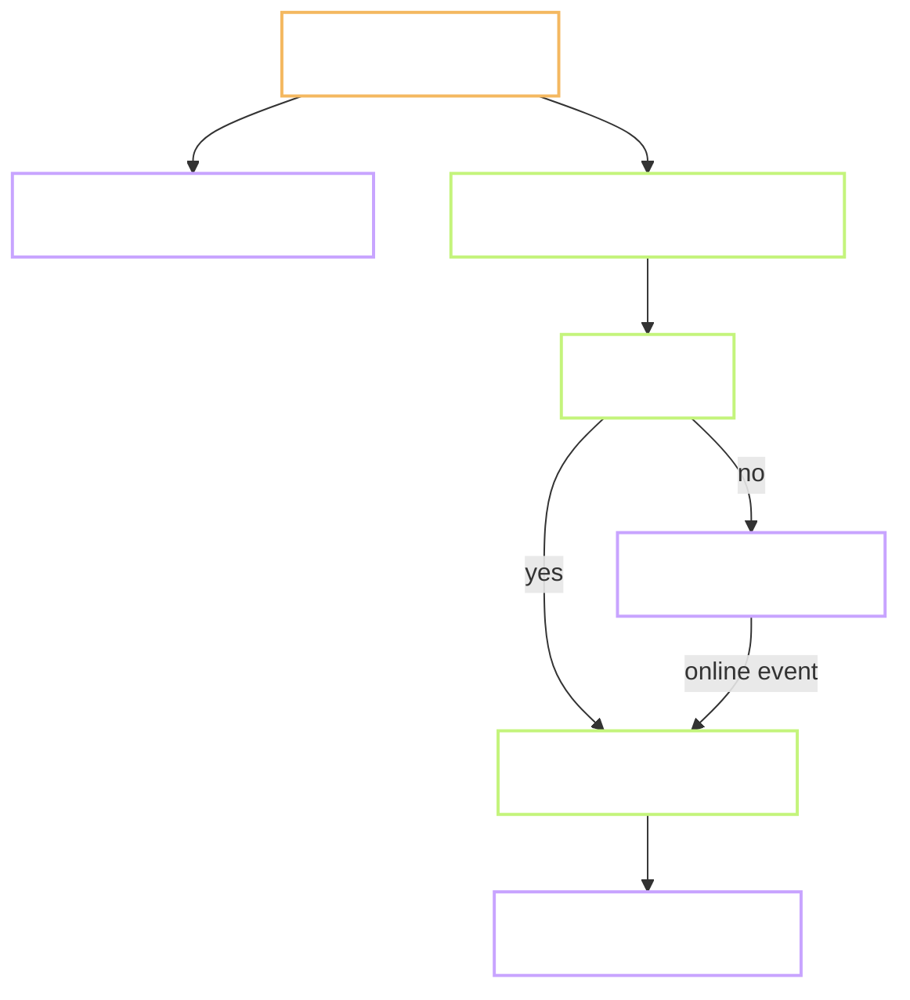

# 13 — Runbook Phase 2 (Tài khoản + Cloud)

Hướng dẫn thao tác thứ tự chặt cho Phase 2 (P2-1 → P2-13). Mọi task đã có prep sẵn ở `src/lib/*.ts` và `db/*` (xem `PROGRESS.md`); runbook này chỉ đi qua các bước còn lại.

Đọc kèm: `05-data-flows.md`, `06-data-model.md`, `11-roadmap.md §11.3`, `PROGRESS.md`.

## 13.0 Điều kiện tiên quyết (blocker — cần user)

Ba việc dưới đây maintainer không tự làm hộ được. Không có 3 cái này thì Phase 2 không chạy được đầu nào.

- **P0-2 — GitHub repo private**
  1. Trên github.com → New repo → Private, không init README.
  2. `git remote add origin git@github.com:<user>/game-hub.git`
  3. `git push -u origin main`
- **P0-3 — Cloudflare Pages**
  1. dash.cloudflare.com → Workers & Pages → Create → connect GitHub.
  2. Chọn repo `game-hub`. Build command `pnpm build`, output `dist`, Node 20.
  3. Environment variables (Production): dán `PUBLIC_SUPABASE_URL`, `PUBLIC_SUPABASE_ANON_KEY` sau khi có ở bước P0-4.
- **P0-4 — Supabase project free**
  1. supabase.com → New project. Region: `Southeast Asia (Singapore)` (gần VN nhất). Password DB nhớ ghi 1Password.
  2. Sau ~2 phút project ready. Vào Settings → API. Copy:
     - `Project URL` → `PUBLIC_SUPABASE_URL`
     - `anon public` key → `PUBLIC_SUPABASE_ANON_KEY`
  3. Ghi vào `.env.local` (không commit — đã trong `.gitignore`):
     ```dotenv
     PUBLIC_SUPABASE_URL=https://xxxxxxxxxxxx.supabase.co
     PUBLIC_SUPABASE_ANON_KEY=eyJhbGciOi...
     ```
  4. Vào Authentication → Providers → bật **Email** (giữ mặc định), bật **Anonymous** (bắt buộc cho MVP).
  5. Authentication → URL Configuration → Site URL: URL Cloudflare Pages ở P0-3. Redirect URLs: thêm `http://localhost:4321/**` cho dev.

## 13.1 Setup local

```powershell
# Cài Supabase CLI (một lần cho máy)
npm i -g supabase

# Kiểm tra
supabase --version

# Link repo vào project (chạy trong D:\Projects\Game-hub)
supabase login
supabase link --project-ref <project-ref-từ-Settings-General>
```

`<project-ref>` là chuỗi 20 ký tự trong URL Supabase (`https://<ref>.supabase.co`).

## 13.2 P2-1 — Chạy migration v1 + v2

Migration đã có sẵn:

- `db/migrations/202609180001_init.sql` (4 bảng)
- `db/migrations/202609210001_rls_rpc.sql` (RLS + RPC + view)

```powershell
supabase db push
```

Verify trong Supabase → SQL Editor:

```sql
select tablename from pg_tables where schemaname = 'public';
-- kỳ vọng: games, profiles, saves, scores

select policyname, tablename from pg_policies where schemaname = 'public';
-- kỳ vọng ~7 policy (profiles read/update/insert, games read, scores read/no-insert, saves own)

select routine_name from information_schema.routines
  where routine_schema = 'public' and routine_type = 'FUNCTION';
-- kỳ vọng: submit_score

select viewname from pg_views where schemaname = 'public';
-- kỳ vọng: weekly_leaderboard_view
```

Nếu thấy lỗi migration, không sửa file cũ. Viết migration mới (`YYYYMMDDHHMM_fix_xxx.sql`) theo `06-data-model.md §6.5`.

## 13.3 P2-2 — Seed catalog

```powershell
# Đường ngắn: dán nội dung db/seed.sql vào SQL Editor rồi Run.
# Đường dài: qua psql
$env:PGPASSWORD = "<db-password>"
psql "postgresql://postgres@db.<project-ref>.supabase.co:5432/postgres" -f db/seed.sql
```

Verify:

```sql
select slug, title, weight, is_active from games order by weight desc;
-- kỳ vọng: snake 100, tetris 95, flappy 90, all is_active true
```

## 13.4 P2-3 — Regenerate DB types + bật generic

Types trong `src/lib/db-types.ts` hiện là hand-written (giữ để dev không phụ thuộc supabase khi chưa có project). Sau P2-1 → regenerate:

```powershell
supabase gen types typescript --project-id <project-ref> --schema public > src/lib/db-types.ts
```

Sau đó bật generic trong `src/lib/supabase.ts`:

```ts
import { createClient, type SupabaseClient } from "@supabase/supabase-js";
import type { Database } from "./db-types";

export type GameHubClient = SupabaseClient<Database>;
// ...
cached = createClient<Database>(url, key, { ... });
```

Chạy `pnpm typecheck`. Nếu TS chửi do `submit_score` args shape khác, sửa `src/lib/api.ts` theo signature mới generated.

## 13.5 P2-4 — Tự tạo profile row khi sign-in ẩn

Đã prep `ensureProfile()` ở `src/lib/auth.ts` — upsert vào `profiles` với nickname từ LS `gh:user`. Kích hoạt:

1. Trong `src/shell/main.ts`, sau `getOrCreateUser()`, gọi `ensureAuth()` + `ensureProfile(user)` một lần khi app boot. Không await (fire-and-forget):

   ```ts
   import { ensureAuth, ensureProfile } from "../lib/auth";
   // ...
   const user = getOrCreateUser();
   void ensureAuth().then(() => ensureProfile(user));
   ```

2. Test tay:
   - `pnpm dev`, mở app.
   - Supabase → Table Editor → `profiles`: 1 row mới, nickname khớp LS, `is_anonymous=true`.

Gotcha: `signInAnonymously` chỉ hoạt động khi tick "Enable anonymous sign-ins" ở Authentication → Providers.

## 13.6 P2-5 — Verify RLS

RLS đã ở migration v2. Kiểm tra bằng anon key (fake JWT):

```sql
-- Trong SQL Editor (chạy với role postgres — không apply RLS)
-- Verify bằng Impersonate role trong dash: Authentication → Users → Impersonate

-- Kỳ vọng khi impersonate 1 user:
select * from profiles;         -- ok, read all
select * from scores;            -- ok, read all
select * from saves;             -- chỉ ra saves của mình
insert into scores(...) values(...);  -- FAIL (policy no direct insert)
```

Đọc `docs/06-data-model.md §6.4` cho danh sách policy đầy đủ.

## 13.7 P2-6 — Verify RPC `submit_score`

Đã tạo ở migration v2, `security definer`, validate + rate limit 10s + idempotent qua `p_client_score_id`.

Test bằng SQL Editor (impersonate user):

```sql
-- Lấy game_id của snake
select id from games where slug = 'snake';
-- Giả sử: 'aaaa-bbbb-...'

-- Gọi RPC
select submit_score(
  p_game_id => 'aaaa-bbbb-...',
  p_score => 1000,
  p_level => 3,
  p_duration_sec => 30,
  p_client_score_id => gen_random_uuid()
);
-- Kỳ vọng: {"rank": 1, "xp_delta": ~69, "new_achievements": []}

-- Gọi lại ngay: expect rate_limited exception
select submit_score(p_game_id => 'aaaa-bbbb-...', p_score => 500, p_duration_sec => 30);
-- Kỳ vọng: ERROR rate_limited

-- Idempotent: gọi cùng client_score_id sau 15s, không insert duplicate.
```

## 13.8 P2-7 — Wire client → RPC

Đã prep `src/lib/report.ts` (`submitScoreRemote`) và wire vào `src/shell/views/game.ts::onScoreSubmitted`. Sau khi 13.1–13.4 xong, cần bổ sung:

- Bật generic `Database` (13.4).
- Đảm bảo `remote-catalog.ts` fetch được (kiểm tra `select id, slug from games` bằng anon key). Nếu RLS chặn, thêm policy trong dev-time hoặc chạy select trong SQL Editor và cache vào LS thủ công.

Test tay end-to-end:

1. `pnpm dev` → chơi Snake, ăn ~5 điểm, thua.
2. Xem console: không có warning `[api] submit_score failed`.
3. Supabase → Table Editor → `scores`: có 1 row mới, `user_id` khớp `id` trong `profiles`.
4. `profiles.xp` tăng ~10–30, `last_played_at` update.

Nếu client offline (DevTools → Network → Offline), submit sẽ enqueue IDB `gh:sync/pending`; online lại thì `sync-queue.flush()` sẽ đẩy lên.



## 13.9 P2-8 — Weekly leaderboard

**Backend đã có:** `weekly_leaderboard_view`, `getWeeklyLeaderboard(gameId)` trong `src/lib/api.ts`.

**UI cần thêm:**

1. Component `src/ui/LeaderboardPanel.tsx` (React island):
   - Props: `gameSlug`, `limit=100`.
   - Effect: `getGameIdBySlug(slug)` → `getWeeklyLeaderboard(id, limit)` → render list (rank, nickname, score, avatar fallback initials).
   - Loading/empty state qua `EmptyState`.
2. Wire vào `views/result.ts` (dưới score card + trước "Thử game khác"):
   ```html
   <section aria-labelledby="lb-heading" class="w-full max-w-2xl mt-8">
     <h2 id="lb-heading" class="text-xl font-display">Bảng xếp hạng tuần</h2>
     <div id="leaderboard-slot"></div>
   </section>
   ```
   Sau đó `createRoot(document.getElementById("leaderboard-slot")).render(<LeaderboardPanel gameSlug={slug} limit={20} />)`.
3. (Optional MVP) Realtime — `sb.channel('scores:'+gameId).on('postgres_changes', {...}, payload => refetch())`. Nếu skip realtime, poll 30s bằng `setInterval`.

**Test:**

- Chơi 2 nickname khác nhau (mở tab ẩn danh), submit score → cả 2 hiện trong bảng, sort desc.
- Test rank: nickname A 1000 điểm, B 500 → A xếp #1.

## 13.10 P2-9 — Cloud save

Backend đã có: `upsertSave`, `getSave` trong `api.ts`; `saves` bảng có xor `state_blob` / `state_url`.

**SDK extend:**

Đã khai báo `saveState?(bytes, slot?)` và `loadState?(slot?)` optional trong `HubContext`. Implement:

- `src/sdk/context.ts::createHubContext`:
  ```ts
  async saveState(bytes: Uint8Array, slot = 0) {
    await putSaveLocal(gameId, slot, bytes);          // IDB local ngay
    await enqueue({                                    // đẩy queue cho cloud
      kind: "save",
      payload: {
        gameId: /* uuid resolve */,
        slot,
        blobBase64: bytesToBase64(bytes),
      },
    });
  },
  async loadState(slot = 0) {
    const local = await getSaveLocal(gameId, slot);
    if (local) return local;
    const cloud = await getSave(await getGameIdBySlug(gameId), slot);
    if (!cloud?.state_blob) return null;
    return base64ToBytes(cloud.state_blob);
  },
  ```
- Thêm `src/lib/local-save.ts` mở IDB `gh:saves` (store `saves`, key `<gameSlug>:<slot>`).

**Wire vào 1 game (Tetris) để verify:**

- Trong `src/games/tetris/game.ts`, khi user nhấn nút `select`, gọi `ctx.saveState?.(serialize())`; khi `start`, gọi `ctx.loadState?.().then(bytes => bytes && deserialize(bytes))`.
- Test: chơi Tetris → save → refresh trang → load → state cũ hiện lại.

Nếu blob > 50KB, chuyển sang R2 (Phase 4). Với native game, không lo — thường < 1KB.

## 13.11 P2-10 — Offline queue verify

Đã prep. Cần verify:

- `pnpm dev` → chơi Snake, DevTools Network → Offline → thua → console không error, `IDB > gh:sync > pending` có 1 row.
- Bật online lại → sau ~1s row biến mất, `scores` table có row mới.
- Test backoff: tắt Supabase project (Settings → Pause), thử submit, `pending.attempts` tăng dần, delay 1s→2s→5s→15s→60s.

Nếu retry vô hạn khó chịu, cân nhắc thêm hard cap (ví dụ 10 attempts → drop + toast "không đồng bộ được"). Chưa cần cho MVP.

## 13.12 P2-11 — Magic-link upgrade

Cho user "kèm email" để giữ tài khoản khi đổi máy. Anonymous session vẫn dùng được ngay, upgrade là opt-in.

**Backend:** Supabase Auth có sẵn `linkIdentity` hoặc `updateUser({ email })` cho anonymous user.

**UI:**

1. Component `src/ui/UpgradeDialog.tsx`:
   - Input email + button "Gửi link".
   - `await supabase.auth.updateUser({ email })` → Supabase gửi confirmation email.
   - Toast "Kiểm tra email để xác nhận".
2. Trong home hero, hiện Chip "Lưu tài khoản" nếu `session.user.is_anonymous === true`.
3. Sau khi user click link email, session refresh → `is_anonymous=false`. Update `profiles.is_anonymous`:
   ```ts
   onAuthStateChange((session) => {
     if (session && session.user.is_anonymous === false) {
       supabase.from("profiles")
         .update({ is_anonymous: false })
         .eq("id", session.user.id);
     }
   });
   ```

**Gotcha:**

- Email template mặc định Supabase là tiếng Anh — chỉnh sang tiếng Việt ở Authentication → Email Templates.
- Redirect URL trong email template phải khớp Site URL + Redirect URLs đã set ở 13.0.

## 13.13 P2-12 — Trang Profile

Route mới `#/profile`.

1. `src/shell/views/profile.ts` render:
   - Nickname (edit inline, update `profiles.nickname` + LS).
   - XP, Level, Streak (đọc `profiles`).
   - Danh sách high-score theo game (query `scores` group by game).
   - Nút "Đăng xuất" → `supabase.auth.signOut()` → clear LS `gh:user` → reload.
   - Nút "Lưu tài khoản" (nếu is_anonymous) → mở `UpgradeDialog`.
2. Wire vào `main.ts` router (thêm case `section === 'profile'`).
3. Nav: thêm link "Hồ sơ" trong `HomeView` (icon + nickname pill top-right, cạnh `ThemeToggle`).

**Edit nickname gotcha:** vi phạm unique index `idx_profiles_nickname_lower` → catch error, toast "Nickname đã có người dùng".

## 13.14 P2-13 — E2E

`tests/e2e/phase2-flow.spec.ts` — kịch bản 1 user hoàn chỉnh:

```ts
test("onboarding → chơi → submit → leaderboard", async ({ page, context }) => {
  await page.goto("/");
  // 1. Chơi Snake
  await page.locator('[data-slug="snake"]').click();
  await page.locator("canvas").focus();
  // Simulate score bằng cách chờ game over (hoặc mock reportScore)
  // ...
  // 2. Result screen hiện
  await expect(page.locator('[data-testid="final-score"]')).toBeVisible();
  // 3. Leaderboard hiện tên mình
  await expect(page.getByRole("heading", { name: /bảng xếp hạng/i })).toBeVisible();
  // 4. Profile page hiển thị XP > 0
  await page.goto("/#/profile");
  const xpText = await page.locator("[data-testid='profile-xp']").textContent();
  expect(Number(xpText)).toBeGreaterThan(0);
});
```

**Chạy được cần:** `.env.local` set env cho playwright (Playwright chỉ tự đọc nếu dev server đọc, nên OK — chỉ cần local dev đọc được).

## 13.15 Deploy production

1. Merge branch `feature/phase-2-*` → main. GitHub Action CI phải xanh.
2. Cloudflare Pages auto-deploy main. Vào Pages settings → Environment variables (Production), điền `PUBLIC_SUPABASE_URL` + `PUBLIC_SUPABASE_ANON_KEY`.
3. Sau khi deploy xong, smoke test URL production:
   - Chơi 1 game, submit score → `scores` table có row với user_id = session anon.
   - Reload → leaderboard hiện chính mình top 1.
4. Nếu 401/403 → check Site URL trong Supabase Auth chưa khớp domain Pages.

## 13.16 Rollback

Nếu Phase 2 lộ lỗi sau deploy:

- **Feature-flag off nhanh:** xoá env `PUBLIC_SUPABASE_URL` ở Cloudflare Pages → `isSupabaseEnabled()` trả false → toàn bộ code Phase 2 no-op, quay lại LS-only. Redeploy.
- **Rollback DB migration:** `supabase db reset` xoá hết. Hoặc chạy tay block `-- +down` trong migration v2 để giữ v1.
- **Rollback code:** `git revert <sha>` các commit Phase 2. UI Phase 1.5 vẫn chạy độc lập.

## 13.17 Kiểm tra sau Phase 2

Checklist đóng phase (khớp `docs/11-roadmap.md §11.7`):

- [ ] `pnpm typecheck` 0 err.
- [ ] `pnpm test` (unit) xanh.
- [ ] `pnpm test:e2e` xanh, kể cả `phase2-flow.spec.ts`.
- [ ] `pnpm lint` xanh.
- [ ] Visual baseline không đổi (Phase 2 chỉ thêm section leaderboard trong result → sinh lại baseline nếu cần).
- [ ] Prod smoke: 1 user thật submit score, xem xuất hiện trên leaderboard trong 30s.
- [ ] Backup Postgres: pg_dump lần đầu (`docs/05-data-flows §5.8`).
- [ ] Cập nhật `PROGRESS.md` P2-1 → P2-13 thành `[x]`, cập nhật header "Trạng thái hiện tại" sang Phase 3.

## 13.18 Follow-up sau Phase 2

Đẩy sang `PROGRESS.md > Follow-up` khi phát sinh:

- Realtime leaderboard (WS) — hiện đang poll 30s.
- Materialized view khi > 100k score (từ `05-data-flows §5.5`).
- Backup pg_dump định kỳ bằng GitHub Action weekly.
- Retry cap cho sync queue (drop sau N attempts + toast).
- Nickname i18n edge case (dấu tiếng Việt trong unique index đã cover bằng `lower()`, kiểm tra thực tế).

## 13.19 Ước lượng thời gian

| Bước | Task ID | Ước tính | Ghi chú |
|---|---|---|---|
| 13.0 blocker | P0-2/3/4 | ~30 phút user | Chờ user chạy |
| 13.1–13.3 | P2-1, P2-2 | 30 phút | Push migration + seed |
| 13.4 | P2-3 | 30 phút | Regen types + bật generic |
| 13.5 | P2-4 | 15 phút | Wire ensureProfile |
| 13.6–13.7 | P2-5, P2-6 | 30 phút | Đọc verify, không viết code mới |
| 13.8 | P2-7 | 30 phút | Test end-to-end wire sẵn |
| 13.9 | P2-8 | 3 giờ | LeaderboardPanel + wire result |
| 13.10 | P2-9 | 4 giờ | SDK saveState/loadState + IDB local + wire Tetris |
| 13.11 | P2-10 | 1 giờ | Verify + edge case backoff |
| 13.12 | P2-11 | 3 giờ | Dialog + email template + link identity |
| 13.13 | P2-12 | 4 giờ | Profile view + nav + edit nickname |
| 13.14 | P2-13 | 2 giờ | E2E full flow |
| 13.15 | Deploy | 30 phút | Set env + smoke |

**Tổng Phase 2 (từ khi P0-4 xong):** ~19 giờ code + 2 giờ verify + deploy. ~3 ngày công.
